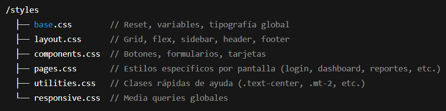

# Prompt 1

**Modelo:** gpt-5-mini (OpenAI)   
**Metodo de Prompt:** Chain-of-thought prompting  

**Prompt exacto en texto:**

``` bash
razona paso a paso y genera una guia para estructurar el HTML5 para una pagina de "simulador de planificacion financiera". 
Donde habran 9 pantallas diferentes navegables mediante un sidebar, estas pantallas son las siguientes: Login. Dashboard Principal. Ingresos y Gastos. Metas de ahorro. Inversiones. Reportes. Historial y Auditoria. Exportacion de Datos. Configuracion de Usuario.
```

**Captura de pantalla del prompt solicitado:**  


**Resultado esperado:**  
Una guia basica para poder ir estructurando la base de la pagina con sus diferentes secciones/pantallas navegables.  

**Resultado obtenido:**  
Una guia con razonamiento paso a paso sobre decisiones de diseño. Estructura global y esqueleto HTML5

**Captura de pantalla del resultado obtenido:**  


**Correcciones manuales realizadas:**
* Se ajusto el contenido para ser adaptado al proyecto

**Aplicacion en el proyecto:**  
Archivo `index.html`