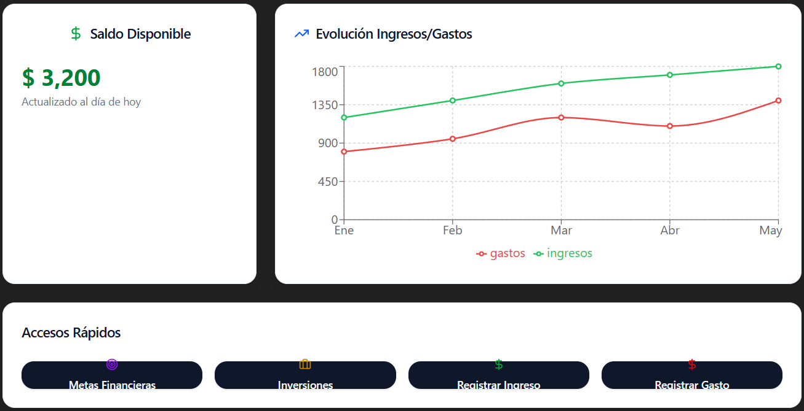

# Prompt 2

**Modelo:** gpt-5-mini (OpenAI)  
**Metodo de Prompt:** Role prompting  

**Prompt exacto en texto:**

``` bash
Actúa como un diseñador web y genera un dashboard para un proyecto de "Simulador de Planificacion Financiera", con resumen del saldo disponible, evolución de ingresos/gastos y accesos rápidos a metas e inversiones.
```

**Captura de pantalla del prompt solicitado:**  


**Resultado esperado:**  
HTML semántico y limpio que funcione como dashboard principal.  

**Resultado obtenido:**  
HTML válido pero con estilos inline que se tendra que separar mas adelante.  

**Captura de pantalla del resultado obtenido:**  


**Correcciones manuales realizadas:**
* Se eliminaran estilos inline.  
* Se agregaran comentarios indicando donde aplicar CSS y JS.  
* Se ajusto el contenido para ser adaptado al proyecto.  

**Aplicacion en el proyecto:**  
Archivo `index.html` - dashboard principal
