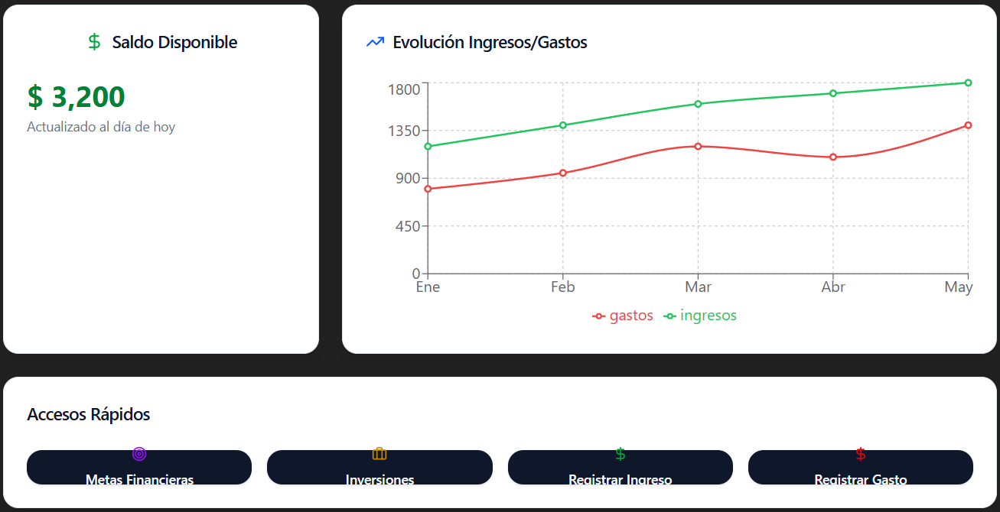

# Prompt 2  

**Modelo:** gpt-5-mini (OpenAI)  
**Método de Prompt:** Role prompting  

**Prompt exacto en texto:**

``` bash
Actúa como un diseñador web y genera un dashboard para un proyecto de "Simulador de Planificación Financiera", con resumen del saldo disponible, evolución de ingresos/gastos y accesos rápidos a metas e inversiones.
```

**Captura de pantalla del prompt solicitado:**  
  

**Resultado esperado:**  
HTML semántico y limpio que funcione como dashboard principal.  

**Resultado obtenido:**  
HTML válido, pero con estilos inline donde estos deberán estar definidos en su carpeta de CSS correspondiente.   

**Captura de pantalla del resultado obtenido:**  
  

**Correcciones manuales realizadas:**
* Se eliminarán estilos inline.  
* Se agregarán comentarios indicando donde aplicar CSS y JS.  
* Se ajustó el contenido para ser adaptado al proyecto.  

**Aplicación en el proyecto:**  
Archivo `index.html` - dashboard principal  
