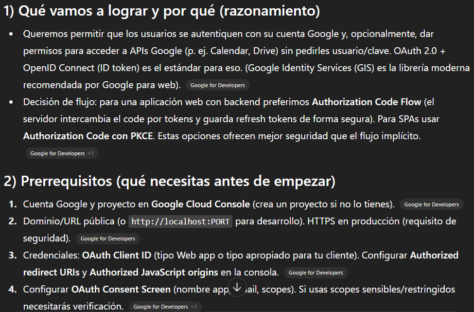

# Prompt 4  

**Modelo:**  gpt-5-mini (OpenAI)  
**Método de Prompt:** Chain-of-thought prompting  

**Prompt exacto en texto:**  

``` bash
Razoná paso a paso y genera una guía para integrar OAuth (Google) para un proyecto llamado "Simulador de Planificación Financiera".
```

**Captura de pantalla del prompt solicitado:**  
  

**Resultado esperado:**  
Una guía completa, paso a paso, que permita a un desarrollador integrar OAuth de Google en su proyecto web. Actualmente la integración no está contemplada, pero incluimos la guía como documentación de planificación para una etapa futura del proyecto.  

**Resultado obtenido:**  
* Explicación del flujo de autenticación (Authorization Code Flow y ID token).  
* Instrucciones detalladas de configuración en Google Cloud Console.  

**Captura de pantalla del resultado obtenido:**  
  

**Correcciones manuales realizadas:**
* Lo planteamos como una guía adaptada al proyecto. Es decir, los ejemplos de código y la estructura de archivos son ilustrativos de cómo se implementaría en próximas iteraciones, pero todavía no forman parte del repositorio actual.  

**Aplicación en el proyecto:**  

