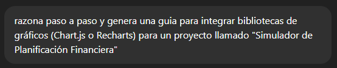
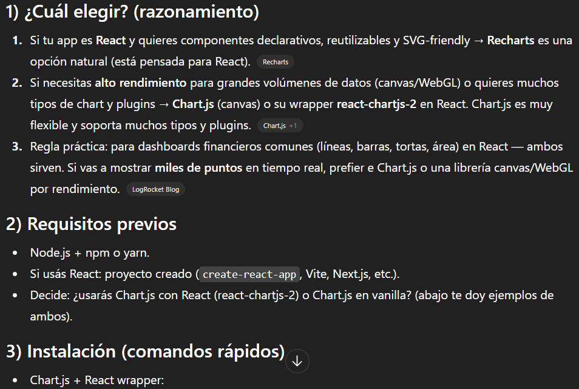

# Prompt 5

**Modelo:** gpt-5-mini (OpenAI)  
**Metodo de Prompt:** Chain-of-thought prompting

**Prompt exacto en texto:**

``` bash
razona paso a paso y genera una guia para integrar bibliotecas de gráficos (Chart.js o Recharts) para un proyecto llamado "Simulador de Planificación Financiera"
```

**Captura de pantalla del prompt solicitado:**  


**Resultado esperado:**  
* Componente React funcional listo para usar.
* Gráfico lineal responsive con datos de ejemplo.
* Explicación paso a paso de importación, registro y uso.

**Resultado obtenido:**  
* Explicación completa sobre imports, registro de Chart.js y uso de props.
* Gráfico lineal renderiza correctamente con datos simulados.

**Captura de pantalla del resultado obtenido:**  


**Correcciones manuales realizadas:**  
* Ajuste los nombres de props de labels y valores para que fueran consistentes con los datos del proyecto.
* Componente LineaBalance.jsx creado.
* Se ajusto el contenido para ser adaptado al proyecto.  

**Aplicacion en el proyecto:**  
Archivo `src/components/charts/LinealBalance.jsx`  
Archivo `src/pages/Dashboard.jsx` - donde se importa y usa el componente
