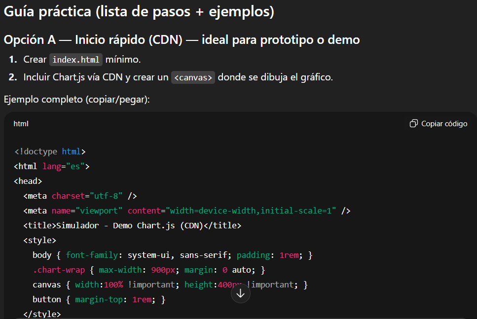

# Prompt 5

**Modelo:** gpt-5-mini (OpenAI)  
**Método de Prompt:** Chain-of-thought prompting  

**Prompt exacto en texto:**  

``` bash
Razoná paso a paso y genera una guía para integrar bibliotecas de gráficos (Chart.js o Recharts) para un proyecto llamado "Simulador de Planificación Financiera". En este proyecto no se utilizará React.
```

**Captura de pantalla del prompt solicitado:**  
  

**Resultado esperado:**   
* Obtener una guía clara, paso a paso, para integrar bibliotecas de gráficos en un proyecto sin React. Actualmente la integración no está contemplada, pero incluimos la guía como documentación de planificación para una etapa futura del proyecto.  

**Resultado obtenido:**  
* Una guía práctica con dos formas de integración:  
    * Opción A (CDN en HTML estático).  
    * Opción B (npm + bundler para producción).  
* Ejemplos de código listos para `index.html`, `main.js` y un módulo `balanceChart.js`.  
* Explicación de funciones útiles: actualización dinámica (`chart.update()`), exportar a PNG, responsive, etc.
* Alternativas (ApexCharts, D3.js).

**Captura de pantalla del resultado obtenido:**  
  

  

  

**Correcciones manuales realizadas:**  
* Lo planteamos como una guía adaptada al proyecto. Es decir, los ejemplos de código y la estructura de archivos son ilustrativos de cómo se implementaría en próximas iteraciones, pero todavía no forman parte del repositorio actual.

**Aplicación en el proyecto:**  

