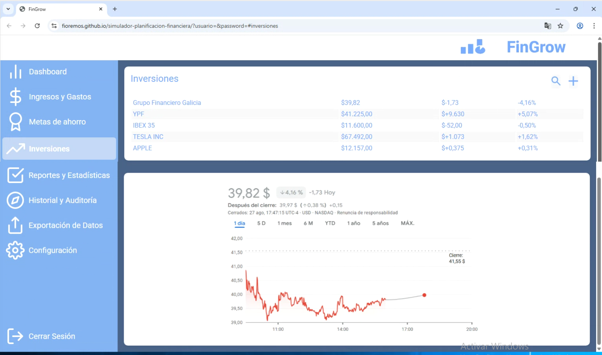
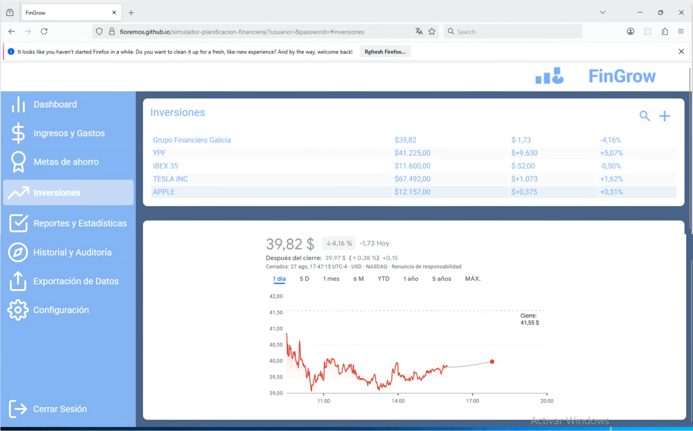
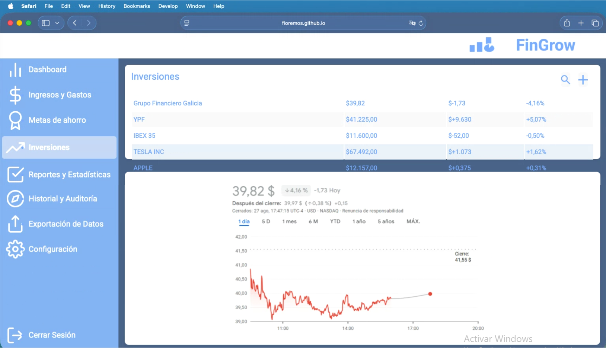
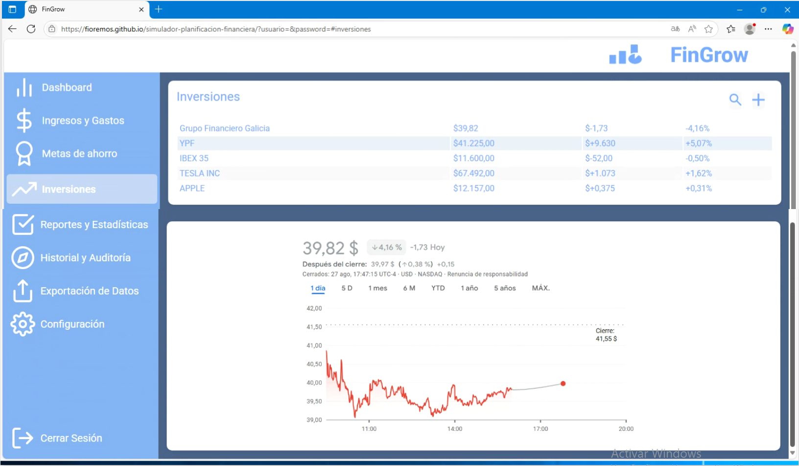
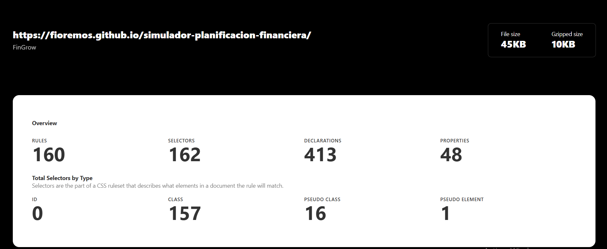
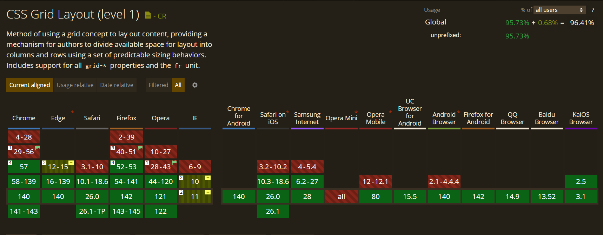
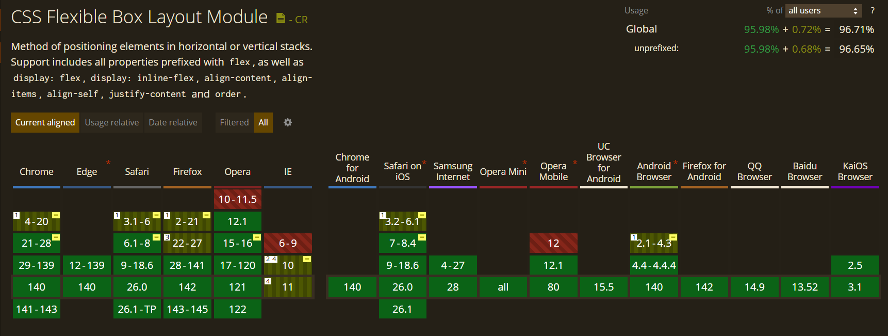
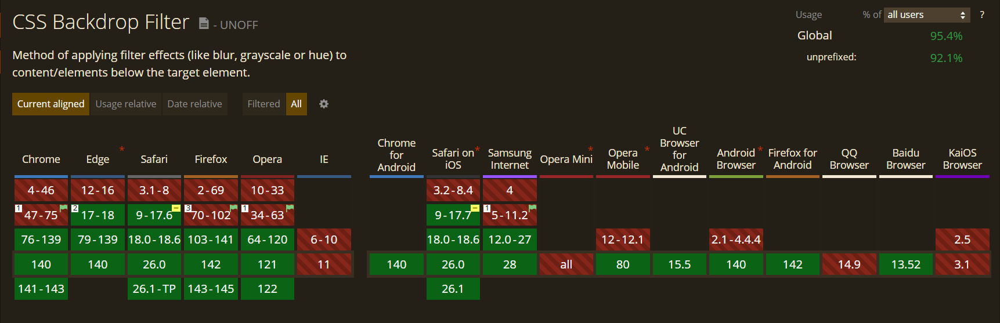
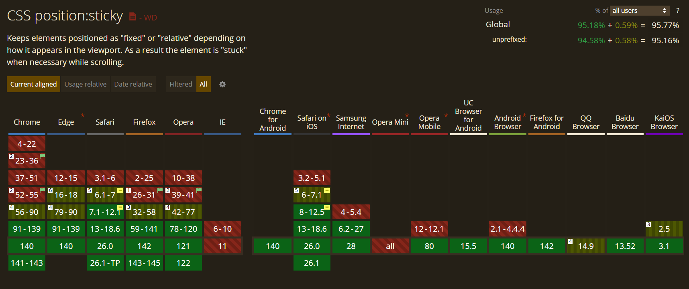

# Test Case 1: Compatibilidad Navegadores Desktop

## Objetivo
Verificar la correcta visualización y funcionalidad en navegadores desktop principales.

## Herramientas Utilizadas
- [BrowserStack Live Testing](https://www.browserstack.com/)
- [Can I Use Database](https://caniuse.com/)
- [CSS Stats](https://cssstats.com/)

## Navegadores Probados
| Navegador | Versión | OS | Resultado |
|-----------|---------|----|-----------|
| Chrome | versión 120 | Windows 11 | ✅ |
| Firefox | versión 119–120 | Windows 11 | ✅ |
| Safari | versión 17.x | macOS | ✅ |
| Edge | versión 120 | Windows 11 | ✅ |

## Capturas de Pantalla
### Chrome

### Firefox

### Safari

### Edge

## Issues Encontrados
✅ Pantallas sin problemas

`Login`, `Ingresos y Gastos`, `Metas de Ahorro`, `Reportes y Estadísticas`, `Historial`, `Exportación de Datos` y `Configuración` se visualizaron correctamente en los cuatro navegadores.

Las diferencias en tonos de azul, intensidad de colores de inputs y estilos nativos de menús desplegables se consideran propias del motor de renderizado de cada navegador y no defectos del diseño implementado.

Pequeñas variaciones en grosor o tamaño de tipografías en elementos destacados en negrita son mínimas y esperables por diferencias de fuentes internas.

⚠️ Inconsistencias menores observadas

**Dashboard – Safari**

Se detecta un desbordamiento en el contenedor inferior “Últimos Movimientos”: la última fila (“Ene. 01”) sobresale del borde inferior del card.
Esto no ocurre en Chrome, Firefox ni Edge.

**Inversiones – Safari**

Problema similar al anterior: en el contenedor superior “Inversiones”,
la última fila (“APPLE”) se muestra por fuera del card.
Correcto en Chrome, Firefox y Edge.

Estilos nativos Safari:
Inputs tipo select y datepicker muestran un estilo metálico/intenso distinto a otros navegadores. Se considera comportamiento estándar de Safari y no error del CSS personalizado.

💡 Recomendaciones sugeridas

- Revisar los cards con overflow en Safari agregando propiedades como overflow: auto o padding-bottom adicional para evitar desbordes.

- Testear con tamaños de viewport distintos en Safari para confirmar si se trata de un bug de responsive o de altura fija.

- Mantener consistencia de fuentes y tamaños revisando font-weight en elementos destacados para minimizar variaciones entre navegadores.

## Métricas de Compatibilidad (por navegador)

**Definición:**  
Se calcula en base al total de propiedades únicas de CSS detectadas con **CSS Stats** (`TotalProps`).  
Para cada navegador, se cuentan las propiedades soportadas según **Can I Use** (`CompatibleProps`).  

**Fórmula:**  
Compatibilidad CSS (por navegador) = (CompatibleProps / TotalProps) * 100

### Evidencias Requeridas
1. **Captura de CSS Stats** mostrando `TotalProps`.  
   

2. **Capturas de 4 propiedades consultadas en Can I Use** (una por imagen), indicando si están soportadas en cada navegador.  
   ropiedades sugeridas:  
   - `grid`  
   - `flexbox`  
   - `backdrop-filter`  
   - `position: sticky`  

   Ejemplo de evidencia:  
     
     
     
     

### Tabla de Resultados
| Navegador | TotalProps | CompatibleProps | Compatibilidad CSS |
|-----------|------------|-----------------|---------------------|
| Chrome | 48 | 48 | 100% |
| Firefox | 48 | 48 | 100% |
| Safari | 48 | 48 | 100% |
| Edge | 48 | 48 | 100% |

> Nota: Esta métrica es **por navegador**, ya que el soporte de propiedades CSS varía entre ellos.