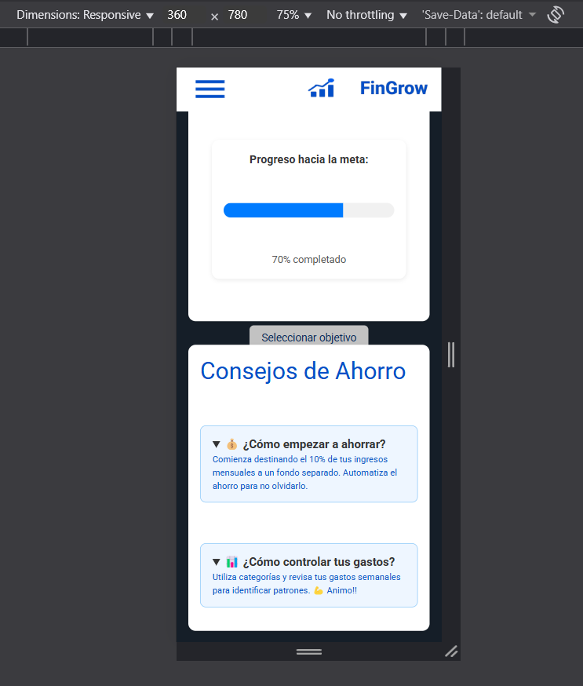
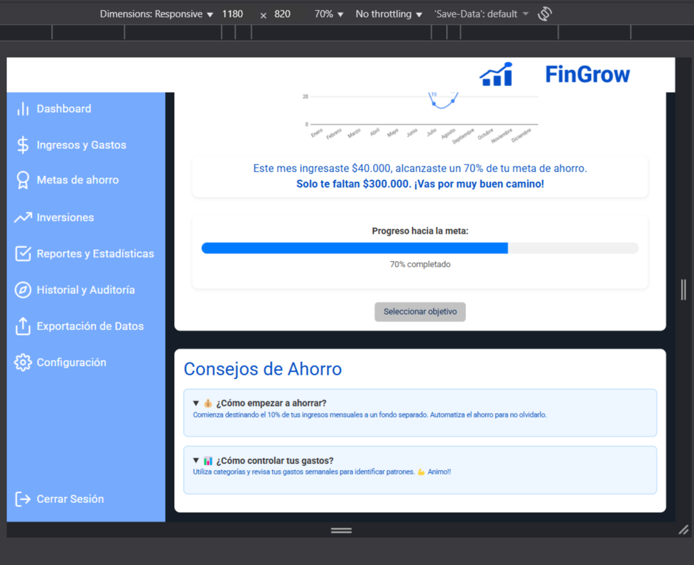

# Test Case 10: Responsive – Implementación de Componente Avanzado HTML (2)

## Objetivo
Validar la integración, compatibilidad y comportamiento responsive de componentes avanzados HTML implementado: **elemento `<progress>`, `<details/summary>`** en diferentes dispositivos.  

## Herramientas Utilizadas
- BrowserStack Mobile Testing  
- Chrome DevTools Device Mode  
- Google PageSpeed Insights  
- Can I Use (verificación de compatibilidad por navegador)  
- W3C HTML Validator (validación de estándares HTML5)  

## Dispositivos Probados
| Dispositivo       | Resolución | Navegador | Orientación         | Resultado |
|-------------------|------------|-----------|---------------------|-----------|
| iPhone 14 Pro     | 393x852    | Safari    | Portrait/Landscape  | ✅ |
| Galaxy S23        | 360x780    | Chrome    | Portrait/Landscape  | ✅ |
| iPad Air          | 820x1180   | Safari    | Portrait/Landscape  | ✅ |
| Desktop (Laptop)  | >1024px    | Chrome    | Landscape           | ✅ |

## Breakpoints Verificados
- **Mobile:** 320px – 768px  
- **Tablet:** 768px – 1024px  
- **Desktop:** 1024px+  

---

## Validaciones específicas
- Confirmar que el componente HTML se adapte a diferentes resoluciones de pantalla.  
- Verificar que **no genere scroll horizontal indeseado**.  
- Validar compatibilidad de controles (play, pause, zoom, interacción táctil).  
- Revisar si el contenido embebido se adapta correctamente al **sistema de grillas de Bootstrap**.  
- Chequear que los estilos personalizados en `css/styles.css`, `css/components.css` y `css/bootstrap-overrides.css` mantengan coherencia visual con el resto del proyecto.  

---

## Uso de herramientas de compatibilidad y validación

- **Can I Use:** Verificar compatibilidad del componente HTML con navegadores principales (ej: Safari iOS, Chrome Android, Edge, Firefox).  
  **Capturas necesarias:**  
    Pantalla de resultados de mostrando la tabla de soporte del componente.
  
  
  

| Componente | Compatibilidad Global | Navegadores compatibles | Limitaciones |
|------------|-----------------------|-------------------------|--------------|
| `<progress> ` | 96.36% | Chrome, Safari, Firefox, Edge, Opera | No soporta estado “indeterminate” en algunos navegadores antiguos.|
| `
/ 
` | 95.87%/ 95.1%  | Chrome, Safari, Firefox, Edge, Opera | En algunos navegadores antiguos no se estilizan correctamente o no son interactivos.| 

- **W3C HTML Validator:** Validar que la implementación del componente sea conforme a HTML5 y no genere errores o warnings de semántica.  
   **Capturas necesarias:**  
 

 **Resultado general:** Se detectaron errores menores estructurales, relacionados con la organización del documento, no con los componentes avanzados implementados.

 | Tipo       | Descripción                                                                                   | Relevancia |
| ---------- | --------------------------------------------------------------------------------------------- | ---------- |
| ⚠️ Error   | Uso del elemento `<main>` dentro de varias `<section>` → No permitido por especificación.     | Medio      |
| ⚠️ Error   | Múltiples elementos `<main>` visibles en un mismo documento.                                  | Medio      |
| ⚠️ Error   | Atributo `alt` con comillas duplicadas (`alt="logo_tacho_borrar""`).                          | Bajo       |
| ⚠️ Error   | IDs duplicados (`movimientos-form`, `inversiones`).                                           | Medio      |
| ⚠️ Warning | Secciones sin encabezado `<h2>` o similar (por ejemplo, “dashboard”, “metas”, “inversiones”). | Bajo       |
| ⚠️ Error   | Elemento `
` sin cerrar dentro de la sección “configuración”.                             | Medio      |

---

## Performance en Mobile

- Medir el impacto del componente en la **performance total de la página** con PageSpeed.

  **Capturas necesarias:**  

  Gráfico de puntuación general

Resultados del test de Google PageSpeed para **mobile**
   
  

  
  
  

- Confirmar que los recursos cargados (ej: scripts de YouTube o mapas) no bloqueen renderización. 

  Sección de Insights y Diagnósticos de PageSpeed donde se evidencie si hay recursos de bloqueo de renderizado.
  
  2. Comparación del **First Contentful Paint (FCP)** y **Largest Contentful Paint (LCP)** antes y después de agregar el componente.  

---

## Capturas esperadas

**iPhone 14 Pro - Progress**

[!Iphone 14 Pro - Landscape](imagenes/test-case-10/iphone-progress-landscape.png)

**iPhone 14 Pro - Details/Summary**

**Galaxy S23 - Progress**

**Galaxy S23 - Details/sumarry**

**iPad Air - Progress - Details/Sumarry**

**Desktop**

---

## Resultado Esperado
- El componente HTML se adapta y funciona correctamente en todos los dispositivos probados.  
- Mantiene la coherencia del diseño e integración con Bootstrap.  
- No afecta de forma crítica la performance en mobile.  
- Es compatible con los principales navegadores según **Can I Use** y válido según **W3C HTML Validator**.  

---

## Issues encontrados
Registrar aquí los problemas detectados y su correspondiente issue en el repositorio:  

| IssueID | Descripción 
|----|-------------|
| [#101](https://github.com/tu-org/tu-repo/issues/101) | Ejemplo: Iframe no escala en versión mobile (iPhone 14 Pro) 