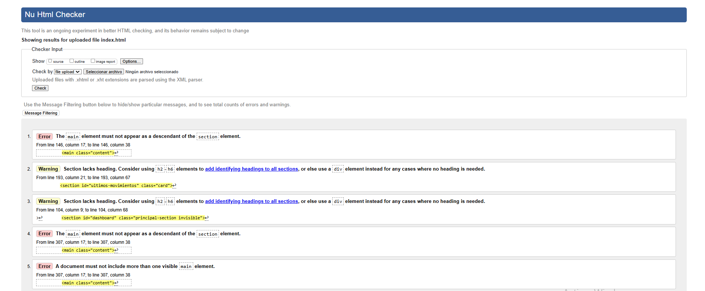
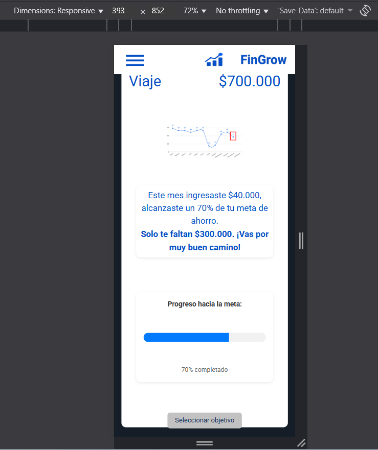

# Test Case 10: Responsive – Implementación de Componente Avanzado HTML (2)

## Objetivo
Validar la integración, compatibilidad y comportamiento responsive de componentes avanzados HTML implementado: **elemento `<progress>`, `<details/summary>`** comprobando su correcta visualización, funcionamiento e impacto en el rendimiento en distintos dispositivos.

## Herramientas Utilizadas  
- Chrome DevTools Device Mode  
- Google PageSpeed Insights  
- Can I Use (verificación de compatibilidad por navegador)  
- W3C HTML Validator (validación de estándares HTML5)  

## Dispositivos Probados
| Dispositivo       | Resolución | Navegador | Orientación         | Resultado | Detalle |
|-------------------|------------|-----------|---------------------|-----------|---------|
| iPhone 14 Pro     | 393x852    | Safari    | Portrait/Landscape  | ✅/⚠️ | En modo landscape el <progress> se ajusta con leve margen lateral fuera del contenedor. |
| Galaxy S23        | 360x780    | Chrome    | Portrait/Landscape  | ✅/⚠️ | En modo landscape el <progress> se ajusta con leve margen lateral fuera del contenedor. |
| iPad Air          | 820x1180   | Safari    | Portrait/Landscape  | ✅ | Visualización estable, ambos componentes correctamente adaptados. |
| Desktop (Laptop)  | >1024px    | Chrome    | Landscape           | ✅ | Los componentes se integran correctamente y mantienen coherencia visual. |

## Breakpoints Verificados
- **Mobile:** 320px – 768px  
- **Tablet:** 768px – 1024px  
- **Desktop:** 1024px+  

---

## Validaciones específicas
- Verificar que el `<progress>` mantenga proporciones correctas y conserve su color y estilo en cada breakpoint.  
- Confirmar que 
/
 funcione correctamente (expandir/colapsar) tanto en dispositivos táctiles como de escritorio.  
- VRevisar su correcta integración con las clases de estilo definidas en `components.css` y `responsive.css`.
- Revisar si el contenido embebido se adapta correctamente al **sistema de grillas de Bootstrap**.  
- Validar que las animaciones, bordes y tipografías mantengan coherencia con el resto del sitio.

---

## Uso de herramientas de compatibilidad y validación

- **Can I Use:** Verificar compatibilidad del componente HTML con navegadores principales (ej: Safari iOS, Chrome Android, Edge, Firefox).  

  **Capturas necesarias:**  

  
  
  

| Componente | Compatibilidad Global | Navegadores compatibles | Limitaciones |
|------------|-----------------------|-------------------------|--------------|
| `<progress> ` | 96.36% | Chrome, Safari, Firefox, Edge, Opera | No soporta estado “indeterminate” en algunos navegadores antiguos.|
| `
/ 
` | 95.87%/ 95.1%  | Chrome, Safari, Firefox, Edge, Opera | En algunos navegadores antiguos no se estilizan correctamente o no son interactivos.| 

- **W3C HTML Validator:** Validar que la implementación del componente sea conforme a HTML5 y no genere errores o warnings de semántica.

   **Capturas necesarias:**  
 

 **Resultado general:** Se detectaron errores menores estructurales, relacionados con la organización del documento, no con los componentes avanzados implementados.

 | Tipo       | Descripción                                                                                   | Relevancia |
| ---------- | --------------------------------------------------------------------------------------------- | ---------- |
| ⚠️ Error   | Uso del elemento `<main>` dentro de varias `<section>` → No permitido por especificación.     | Medio      |
| ⚠️ Error   | Múltiples elementos `<main>` visibles en un mismo documento.                                  | Medio      |
| ⚠️ Error   | Atributo `alt` con comillas duplicadas (`alt="logo_tacho_borrar""`).                          | Bajo       |
| ⚠️ Error   | IDs duplicados (`movimientos-form`, `inversiones`).                                           | Medio      |
| ⚠️ Warning | Secciones sin encabezado `<h2>` o similar (por ejemplo, “dashboard”, “metas”, “inversiones”). | Bajo       |
| ⚠️ Error   | Elemento `
` sin cerrar dentro de la sección “configuración”.                             | Medio      |

---

## Performance en Mobile

- Medir el impacto del componente en la **performance total de la página** con PageSpeed.

Resumen de Resultados:

| Categoría | Puntuación | Observaciones |
|-----------|------------|---------------|
| Rendimiento | 49 | El componente `<progress>` y `
` no impactan directamente; los problemas provienen de bloqueo de renderizado y archivos JS/CSS sin minificar. |
| Prácticas Recomendadas | 93 | Se detectó una imagen con relación de aspecto incorrecta. |
| Accesibilidad | 100 | Los componentes son completamente accesibles y legibles. |
| SEO | 91 |Falta metadescripción, sin relación con los componentes probados. |

  
  **Capturas necesarias:**  

   

  
  
  
 

  Sección de Insights y Diagnósticos de PageSpeed donde se evidencie si hay recursos de bloqueo de renderizado.
  

  Insights relevantes:

- El FCP es de 2.4 segundos y el TBT alto indica bloqueo por scripts, no por los nuevos componentes.
- Ambos elementos <progress> y 
 tienen carga nativa y ligera, sin impacto negativo.
- Recomendación: optimizar recursos globales (defer JS y minificar CSS).

---

## Capturas esperadas

**iPhone 14 Pro - Progress**

**iPhone 14 Pro - Details/Summary**

**Galaxy S23 - Progress**

**Galaxy S23 - Details/sumarry**

**iPad Air - Progress - Details/Sumarry**

**Desktop**

---

## Resultado Esperado
- Ambos componentes mantienen su funcionalidad y apariencia en todas las resoluciones probadas. 
- No afectan negativamente la performance general ni la accesibilidad del sitio.  
- Presentan alta compatibilidad según Can I Use.
- Validados según estándares W3C HTML5. 

---

## Issues encontrados
Registrar aquí los problemas detectados y su correspondiente issue en el repositorio:  

| IssueID | Descripción 
|----|-------------|
| [#56](https://github.com/fioremos/simulador-planificacion-financiera/issues/56) | El componente progress pierde margen interno al rotar la pantalla, generando un desbordamiento hacia abajo del contenedor. |
| [#57](https://github.com/fioremos/simulador-planificacion-financiera/issues/57) | Desbordamiento de el componente details en orientación landscape. |