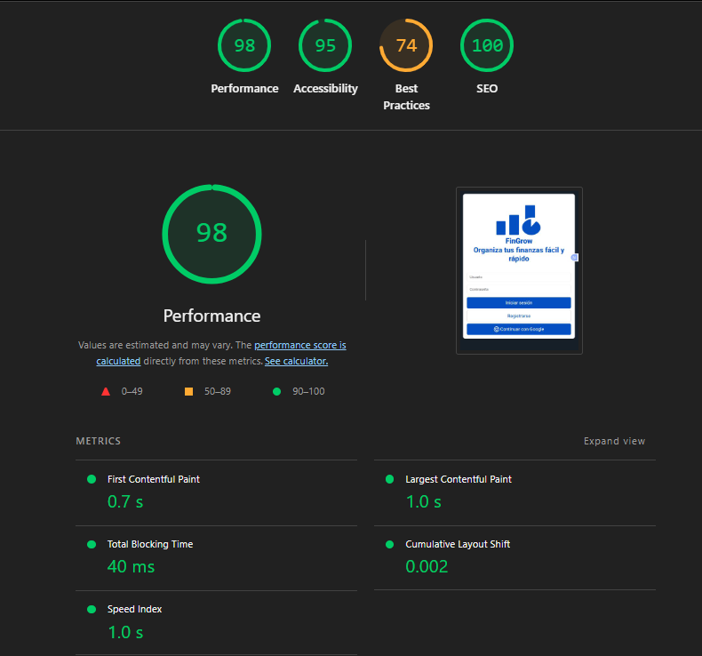

# Test Case 11: Auditoría Lighthouse - Baseline Inicial

## Información General
- **Fecha de ejecución:** 23/11/2025
- **URL testeada:** [Link de Live Server](http://127.0.0.1:5500/index.html#login)
- **Rama:** feature/tester-qa-js-testing-suite
- **Navegador:** Chrome 142

## Umbrales Mínimos Definidos
- **Performance:** >= 80
- **Accessibility:** >= 90
- **Best Practices:** >= 85
- **SEO:** >= 80

## Resultados Obtenidos

### Performance: [98]
- First Contentful Paint: **0.7 s**
- Largest Contentful Paint: **1.0 s**
- Total Blocking Time: **40ms**
- Cumulative Layout Shift: **0.002**
- Speed Index: **1.0s**

### Accessibility: [95]
- **Touch targets do not have sufficient size or spacing:** (Elementos interactivos demasiado pequeños o muy juntos.)
- **ARIA IDs are unique (Passed):** (Los IDs de ARIA son únicos)

### Best Practices: [74] (Por debajo del minimo)
- **Uses deprecated APIs (1 warning):** El código está utilizando métodos de JavaScript o APIs del navegador que ya no se recomiendan y podrían dejar de funcionar en versiones futuras.
- **Browser errors were logged to the console:** Existen errores no capturados (posibles `throw` sin `catch` o recursos 404) que ensucian la consola y pueden detener la ejecución de scripts.
- **Issues logged in Chrome DevTools:** Existen problemas generales reportados en el panel de Issues que deben resolverse.

### SEO: [100]
- No se presentan observaciones. La estructura de metadatos y configuración básica es correcta.

## Issues Generadas
- [#169](https://github.com/fioremos/simulador-planificacion-financiera/issues/169#) **Limpieza de Consola y APIs Deprecadas:** Corregir los errores reportados en consola y actualizar APIs antiguas para elevar el puntaje de Best Practices (Actual: 74, Objetivo: >=85).
- [#170](https://github.com/fioremos/simulador-planificacion-financiera/issues/170#) **Mejorar Touch Targets:** Aumentar el tamaño o espaciado de elementos interactivos para cumplir con los estándares de accesibilidad móvil.

## Conclusiones
El estado actual del proyecto (Baseline) muestra una base sólida en términos de **Performance (98)** y **SEO (100)**, lo cual indica una buena estructura HTML y carga rápida de recursos. La **Accesibilidad (95)** también es correcta.

Sin embargo, el proyecto **NO cumple con los criterios de aceptación en Best Practices (74)**. Esto se debe principalmente a "suciedad" en el código (console.logs, errores no manejados o librerías antiguas). Es necesario resolver estos errores de consola antes de integrar las nuevas funcionalidades de Fetch y Librerías Externas para evitar una degradación mayor de la calidad del código.