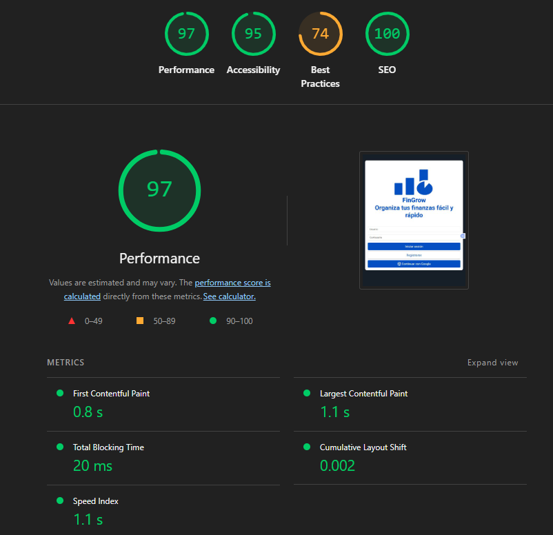
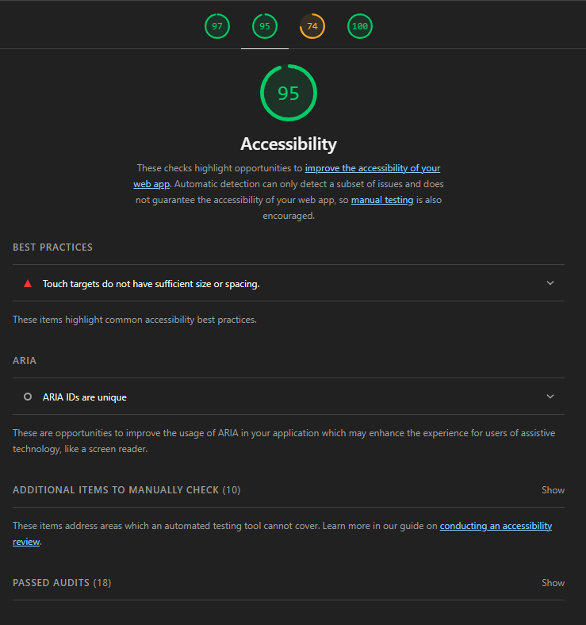

# Test Case 12: Auditoría Lighthouse - Post Fetch/API

## Información General
- **Fecha de ejecución:** 24/11/2025
- **URL testeada:** [Entorno Live Server](http://127.0.0.1:5500/index.html)
- **Rama:** feature/tester-qa-js-testing-suite (Integración con API)
- **Cambios implementados:**
  - Consumo de API simulada mediante `ApiService`.
  - Procesamiento asíncrono de datos para categorías.
  - Manejo de estados de carga (EventBus).

## Resultados Obtenidos

### Performance: 97 
- First Contentful Paint: **0.8 s**
- Largest Contentful Paint: **1.1 s**
- Total Blocking Time: **20 ms**
- Cumulative Layout Shift: **0.002**

### Accessibility: 95 (Aprobado)
- Se mantienen las advertencias de "Touch Targets" (Botones pequeños) reportadas en el Baseline.
- No se introdujeron nuevos errores de accesibilidad con la carga asíncrona.

### Best Practices: 74 (Requiere Atención)
- Persisten los errores de consola identificados en el Baseline.
- El consumo de API no generó nuevos errores visibles en consola.

### SEO: 100

## Comparación con Baseline

| Métrica | Baseline | Post-Fetch (Actual) | Diferencia |
|---------|----------|---------------------|------------|
| Performance | 98 | **97** | -1 🔻 |
| Accessibility | 95 | **95** | 0 = |
| Best Practices | 74 | **74** | 0 = |
| SEO | 100 | **100** | 0 = |

### Análisis de Impacto (Foco: API)
- **Performance:** El impacto de la asincronía fue mínimo (-1 punto). La carga de datos no bloquea el renderizado inicial gracias al uso correcto de promesas.
- **Estabilidad:** La implementación de `ApiService` con manejo de errores evita que la interfaz se rompa si la API falla.

## Issues Generadas
- Se mantienen abiertos los issues de Accesibilidad y Best Practices del Baseline para ser resueltos en la etapa final de integración.

## Conclusiones
La integración del módulo de datos asíncronos (`ApiService`) fue exitosa. El rendimiento se mantuvo dentro de los estándares óptimos (>90) y no se degradó la experiencia de usuario durante la carga de datos.