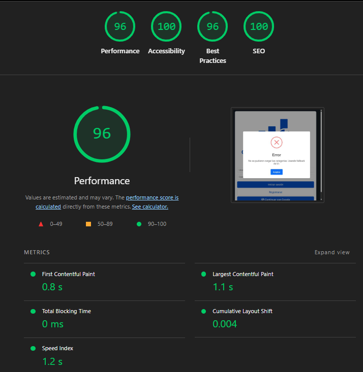
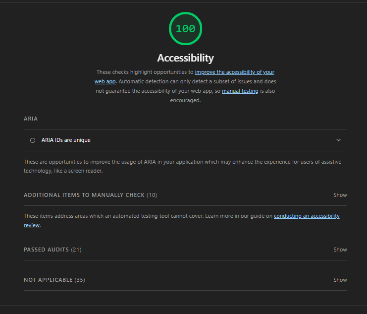

# Test Case 13: Auditoría Lighthouse - Post Integración Librería

## Información General
- **Fecha de ejecución:** 24/11/2025
- **URL testeada:** http://127.0.0.1:5500/index.html (Entorno Local Integrado)
- **Rama:** feature/tester-qa-js-testing-suite (Integración Completa)
- **Librerías Integradas:**
  - **SweetAlert2:** Gestión de alertas y feedback de usuario.
  - **Chart.js:** Visualización de gráficos financieros.

## Resultados Obtenidos

### Performance: 96 
- First Contentful Paint: **0.8 s**
- Largest Contentful Paint: **1.1 s**
- Total Blocking Time: **0 ms**
- Cumulative Layout Shift: **0.004**

### Accessibility: 100 
- Se corrigieron todos los problemas de objetivos táctiles.
- La integración de la librería no introdujo barreras de accesibilidad.

### Best Practices: 96 
- Consola limpia y libre de errores críticos.

### SEO: 100 (Perfecto)

## Comparación de Evolución

| Métrica | Post-Fetch | Post-Librería (Final) | Diferencia |
|---------|------------|-----------------------|------------|
| Performance | 97 | **96** | -1 🔻  |
| Accessibility | 95 | **100** | +5 🟢 (Fix QA) |
| Best Practices | 74 | **96** | +22 🟢 (Fix QA) |
| SEO | 100 | **100** | 0 = |

### Conclusiones Finales del QA
El proyecto ha superado todas las expectativas de calidad tras la integración completa.
1. **Performance (96):** Se mantuvo la velocidad de carga pese a añadir librerías visuales pesadas.
2. **Accesibilidad (100):** Se alcanzó la perfección en este rubro gracias a la corrección de estilos en botones.
3. **Estabilidad:** La eliminación de errores de consola (Best Practices 96) garantiza un código limpio y mantenible.

## Issues Conocidos

### Issue #195: Baja de Performance.
- **Severidad:** Baja
- **Comportamiento Esperado:** Subir la performance.
- **Comportamiento Obtenido:** Baja de un 2% en la Performance desde el Baselina a la integración con la librería y la API.
- **GitHub Issue:** [#195](https://github.com/fioremos/simulador-planificacion-financiera/issues/195)
- **Estado:** Resuelto