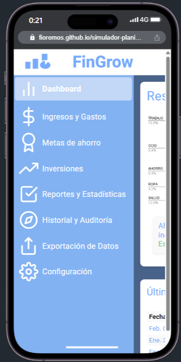
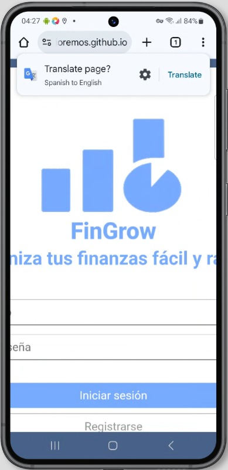
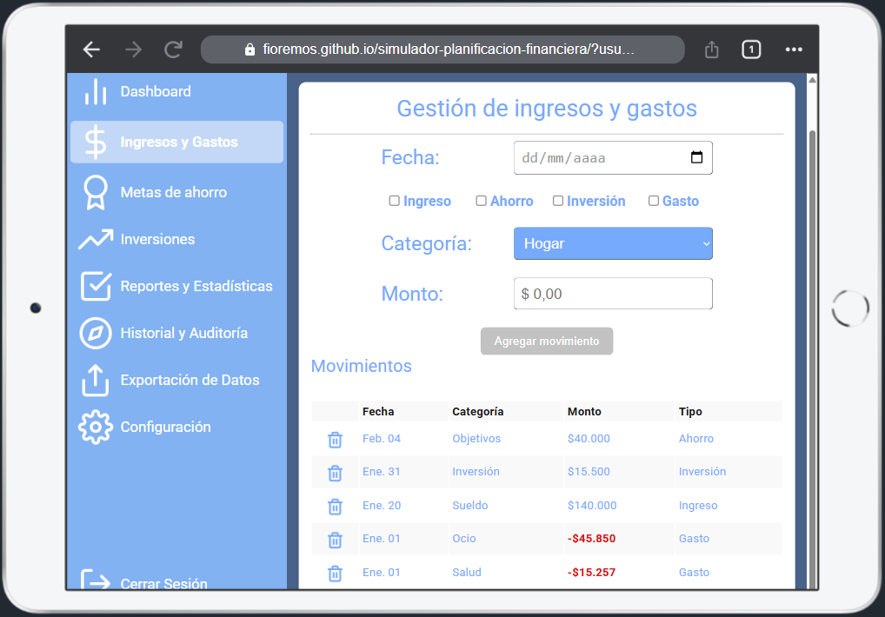
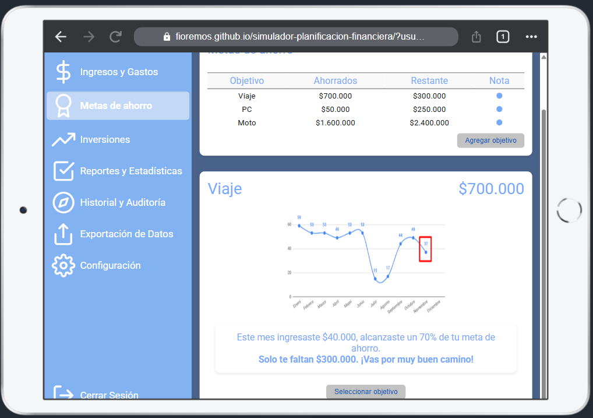
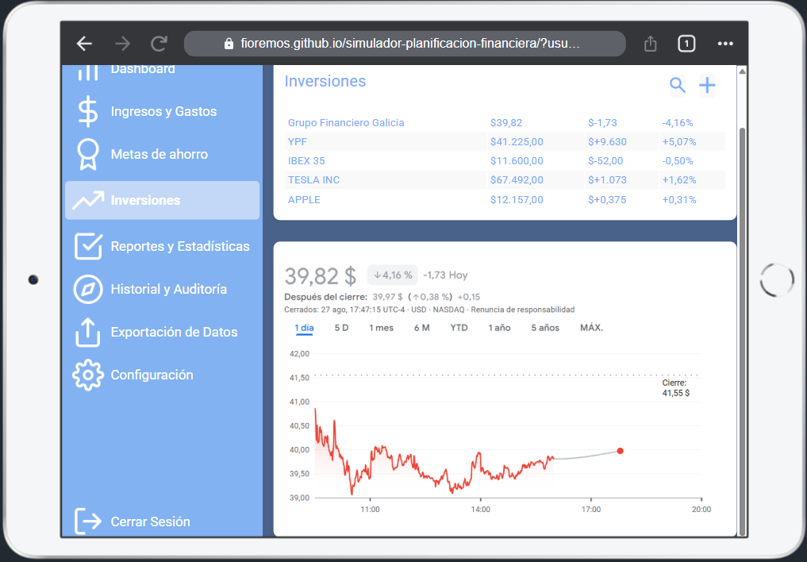
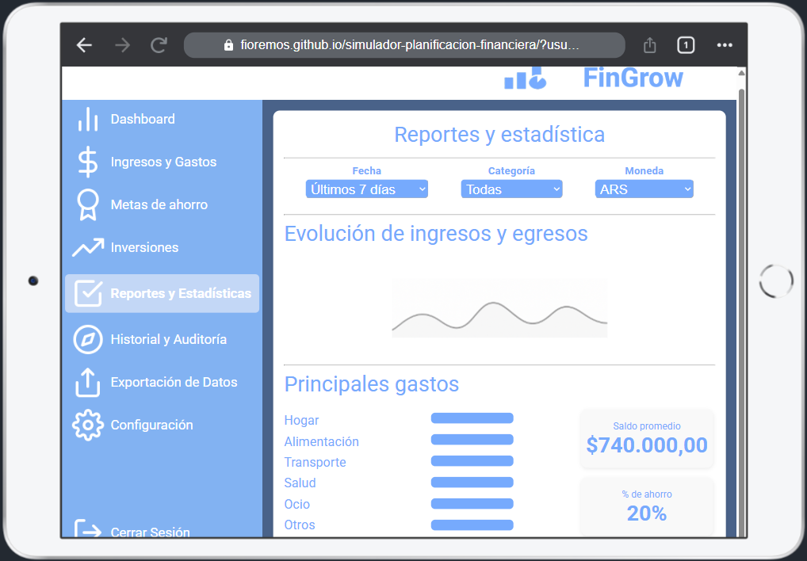
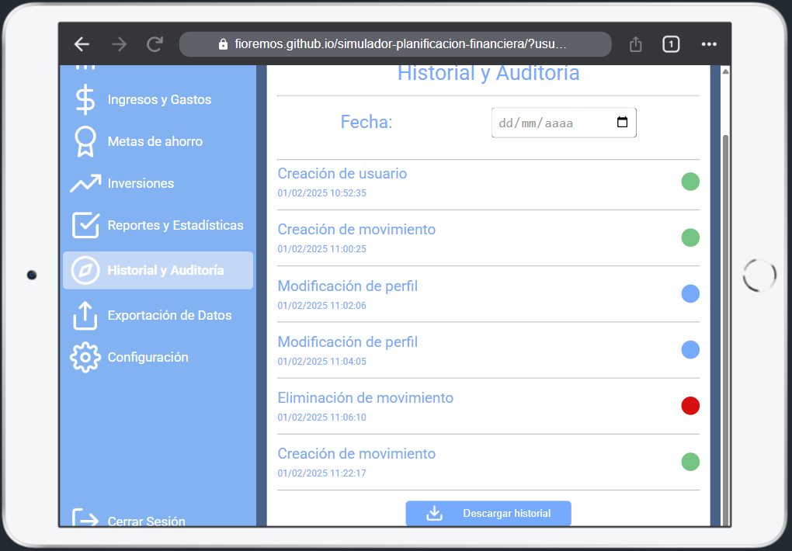
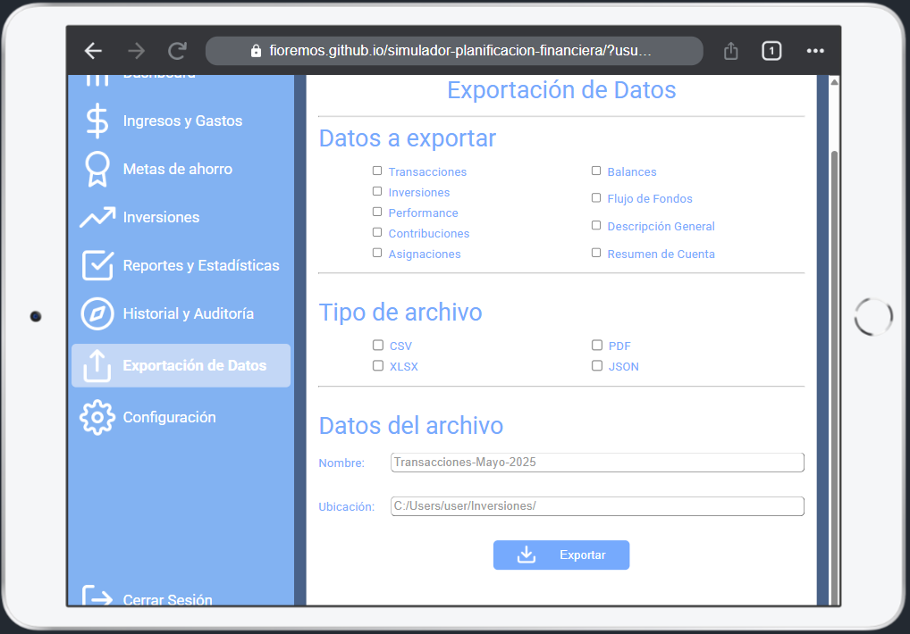

# Test Case 2: Testing Responsive Móviles

## Objetivo
Verificar la adaptabilidad responsive en dispositivos móviles reales

## Herramientas Utilizadas
- [BrowserStack Real Device Testing](https://www.browserstack.com/)
- [Chrome DevTools Device Simulation](https://developer.chrome.com/docs/devtools/device-mode/)

## Dispositivos Probados
| Dispositivo | Resolución | Navegador | Orientación | Resultado |
|-------------|------------|-----------|-------------|-----------|
| iPhone 14 Pro | 393x852 | Safari | Portrait | ❌ |
| Galaxy S23 | 360x780 | Chrome | Portrait | ❌ |
| iPad Air | 820x1180 | Safari | Portrait/Landscape | ❌ |

## Breakpoints Verificados
- Mobile: 320px - 768px
- Tablet: 768px - 1024px
- Desktop: 1024px+

## Capturas por Dispositivo

**iPhone 14 Pro (Safari):**

**Galaxy S23 (Chrome):**

**iPad Air (Safari):**

## Issues Encontrados

⚠️ iPhone 14 Pro y Galaxy S23:

Solo se adjuntaron capturas del Login y Dashboard ya que, al navegar por las demás secciones, la barra lateral ocupa todo el ancho o el contenido se corta, mostrando el mismo problema en todas las pantallas. 
El diseño no es responsive: contenido cortado, elementos fuera de pantalla, imposibilidad de ver secciones completas.

⚠️ iPad Air:

Se incluyeron capturas de todas las pantallas porque se visualiza más el contenido por las dimensiones y orientación, aunque también presenta cortes en los elementos a la derecha.

General:

No existen adaptaciones específicas para dispositivos móviles

## Media Queries Validadas
No se validaron media queries específicas, ya que el diseño actual no es responsive y no se aplican reglas CSS diferentes según ancho de pantalla.