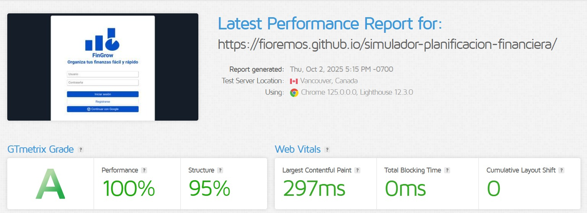
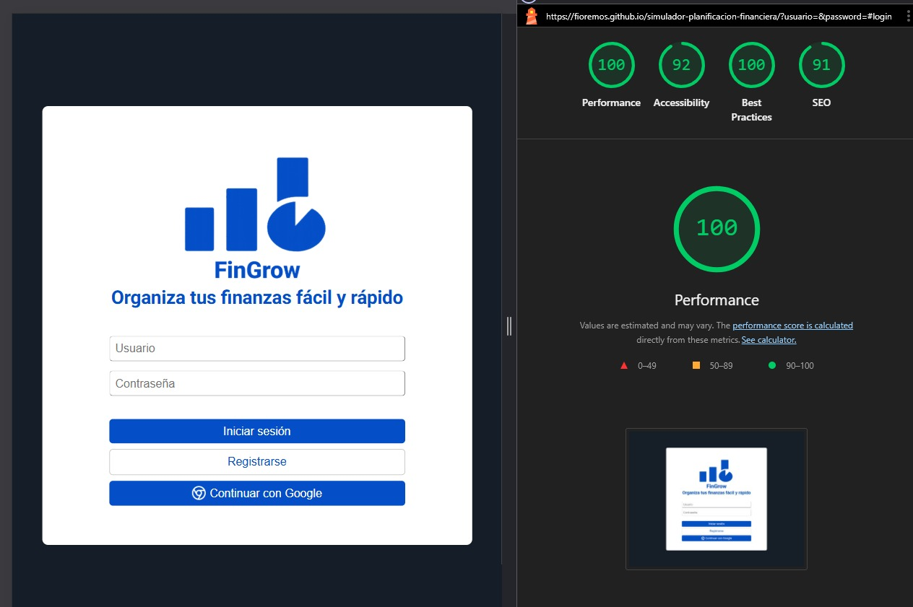

# Test Case 3: Performance y Velocidad de Carga

## Objetivo
Evaluar el rendimiento de la página en términos de velocidad de carga y métricas Core Web Vitals.

## Herramientas Utilizadas
- Google PageSpeed Insights
- GTmetrix
- Chrome DevTools Lighthouse

## Capturas Requeridas

### Entrega 1

1. **Google PageSpeed Insights**

2. **GTmetrix**

3. **Chrome DevTools Lighthouse**

### Entrega 2

1. **Google PageSpeed Insights**

2. **GTmetrix**

3. **Chrome DevTools Lighthouse**

## Métricas Obtenidas en la Entrega 2

### Google PageSpeed Insights
- **Performance Score:** 100/100
- **First Contentful Paint (FCP):** 0.7 s
- **Largest Contentful Paint (LCP):** 0.7 s
- **Cumulative Layout Shift (CLS):** 0
- **First Input Delay (FID):** N/A 

### GTmetrix Results
- **GTmetrix Grade:** A
- **Performance:** 100%
- **Structure:** 95%
- **Fully Loaded Time:** 0.591 s
- **Page Size:** 0.471 MB

### Lighthouse Audit
- **Performance Score:** 100/100
- **First Contentful Paint (FCP):** 0.5 s
- **Largest Contentful Paint (LCP):** 0.5 s
- **Cumulative Layout Shift (CLS):** 0
- **Total Blocking Time (TBT):** 0 ms
- **Speed Index (SI):** 0.5 s

## Optimizaciones Implementadas

1. Uso de variables CSS (:root):

    - Evita recalcular colores/estilos en cada selector.
    - Centraliza la paleta, lo que hace el render más rápido y consistente.
    
2. Separación de estilos en style.css y components.css
    - Mejora la caché del navegador, ya que los archivos CSS se descargan una sola vez y se reutilizan en todas las páginas.
    - Evitar estilos inline en HTML.

3. Uso de herencia de estilos

    - Definir tipografía y color base en body, entonces todos los elementos heredan sin repetir reglas innecesarias.

    - Uso de flex y grid en lugar de "hacks" (floats, position, etc.).

    - Layouts modernos que el navegador optimiza mejor, en lugar de floats o posiciones absolutas que obligan a más cálculos de reflow.

4. Elementos reutilizables (componentes)
    
    - Botones, inputs, cards definidos una vez, entonces hay menos duplicación de reglas, menos peso de CSS y menos trabajo para el motor de render.

5. Carga ligera (sin frameworks pesados)

    - Usar HTML + CSS puro, y solo un poco de JS vanilla, hace que el tiempo de carga sea menor comparado con usar librerías externas.

## Comparativas Antes/Después
### GTmetrix

||Entrega 1| Entrega 2|
|-|-|-|
|Performance|100 %|100 %|
|Esctructura|100 %|95 %|
|Fisrt Contentful Paint|102 ms|297 ms|
|Time to interactive|102 ms|297 ms|
|Speed Index|95 ms|304 ms|
|Largest Contentful Paint|102 ms|297 ms|

### Lighthouse

||Entrega 1| Entrega 2|
|-|-|-|
|Performance|90 %|100  %|
|Accesibility|93 %|92 %|
|Best practices|100 %|100 %|
|SEO|90 %|91 %|
|Fisrt Contentful Paint|0.3 s|0.5 s|
|Largest Contentful Paint|0.3 s|0.5 s|
|Speed Index|12.8 s|0.5 s|

### PageSpeed

||Entrega 1| Entrega 2|
|-|-|-|
|Performance|100 %|100 %|
|Accesibility|93 %|92 %|
|Best practices|81 %|100 %|
|SEO|90 %|91 %|
|Fisrt Contentful Paint|0.2 s|0.7 s|
|Largest Contentful Paint|0.2 s|0.7 s|
|Speed Index|0.2 s|0.7 s|

