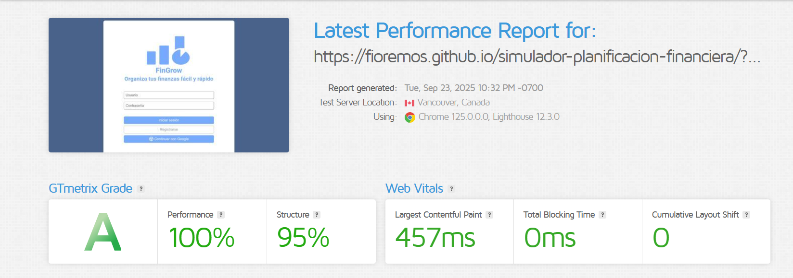

# Test Case 3: Performance y Velocidad de Carga

## Objetivo
Evaluar el rendimiento de la página en términos de velocidad de carga y métricas Core Web Vitals.

## Herramientas Utilizadas
- Google PageSpeed Insights
- GTmetrix
- Chrome DevTools Lighthouse

## Capturas Requeridas
Se deben adjuntar **capturas de pantalla reales** de cada herramienta mostrando los resultados obtenidos.

1. **Google PageSpeed Insights**

2. **GTmetrix**

3. **Chrome DevTools Lighthouse**

## Métricas Obtenidas

### Google PageSpeed Insights
- **Performance Score:** 100/100
- **First Contentful Paint (FCP):** 0.7 s
- **Largest Contentful Paint (LCP):** 0.7 s
- **Cumulative Layout Shift (CLS):** 0
- **First Input Delay (FID):** N/A (no se refelja en la captura)

### GTmetrix Results
- **GTmetrix Grade:** A
- **Performance:** 100%
- **Structure:** 95%
- **Fully Loaded Time:** 0.631 s
- **Page Size:** 0.507 MB

### Lighthouse Audit
- **Performance Score:** 97/100
- **First Contentful Paint (FCP):** 2.0 s
- **Largest Contentful Paint (LCP):** 2.3 s
- **Cumulative Layout Shift (CLS):** 0.001
- **Total Blocking Time (TBT):** 0 ms
- **Speed Index (SI):** 2.0 s

## Optimizaciones Implementadas
No se cuenta con información sobre las optimizaciones que se implementaron para llegar a los resultados actuales.

## Comparativas Antes/Después
No se realizaron análisis de datos de optimizaciones previas.