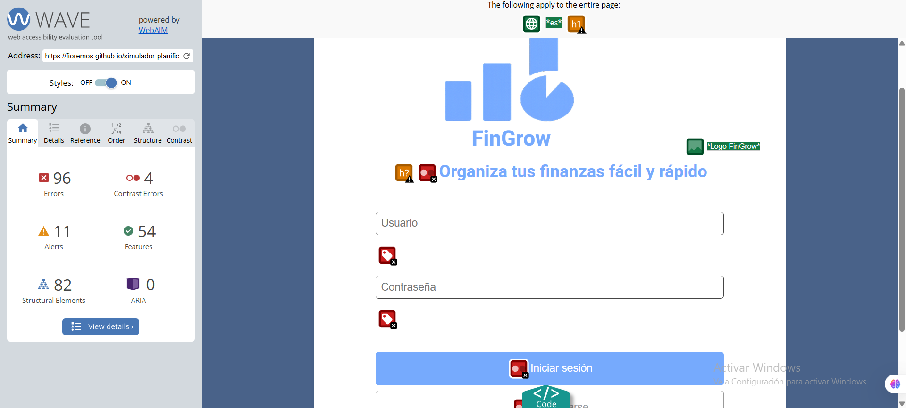
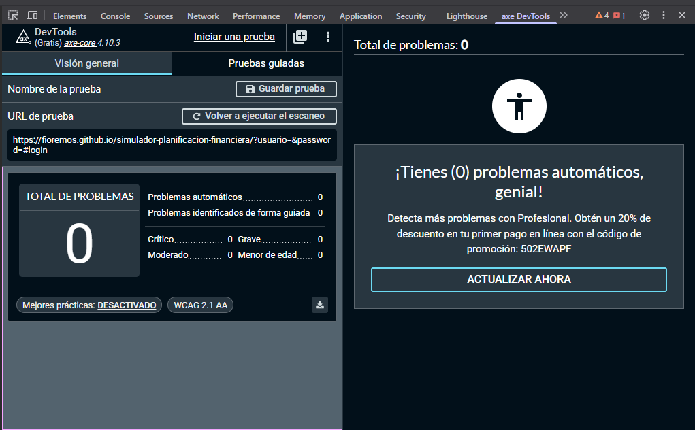

# Test Case 4: Accesibilidad Web (WCAG 2.1)

## Objetivo
Verificar el cumplimiento de estándares de accesibilidad WCAG 2.1 AA

## Herramientas Utilizadas
- WAVE Web Accessibility Evaluator
- axe DevTools Extension
- Lighthouse Accessibility Audit

## Resultados WAVE
- **Errores:** 96
- **Alertas:** 11 
- **Características:** 54
- **Elementos Estructurales:** 82
- **ARIA:** 0

### Captura WAVE Report

## Resultados axe DevTools
- **Violations:** 0
- **Needs Review:** 0
- **Passes:** No se muestra un número en la captura, pero el mensaje indica que no hay problemas automáticos, por lo que el test es exitoso.

### Captura Resultados axe DevTools

## Lighthouse Accessibility Score
- **Puntuación:** 92/100

## Tests Manuales Realizados
- ✅ Navegación completa por teclado
- ✅ Contraste de colores adecuado
- ✅ Texto alternativo en imágenes
- ✅ Etiquetas de formularios correctas
- ✅ Estructura semántica HTML

## Issues de Accesibilidad Encontrados
- Problema 1: Alto número de errores detectados por WAVE (96) principalmente por falta de texto alternativo en imágenes decorativas.
Solución propuesta: Revisar todas las imágenes e incluir atributos alt descriptivos cuando corresponda.

- Problema 2: Algunos botones secundarios presentan contraste borderline con el fondo azul claro.
Solución propuesta: Ajustar la paleta de colores para cumplir con el contraste mínimo 4.5:1 recomendado por WCAG 2.1.

- Problema 3: Algunos encabezados carecen de jerarquía correcta (salto de <h2> a <h4>).
Solución propuesta: Reestructurar encabezados para mantener jerarquía lógica.