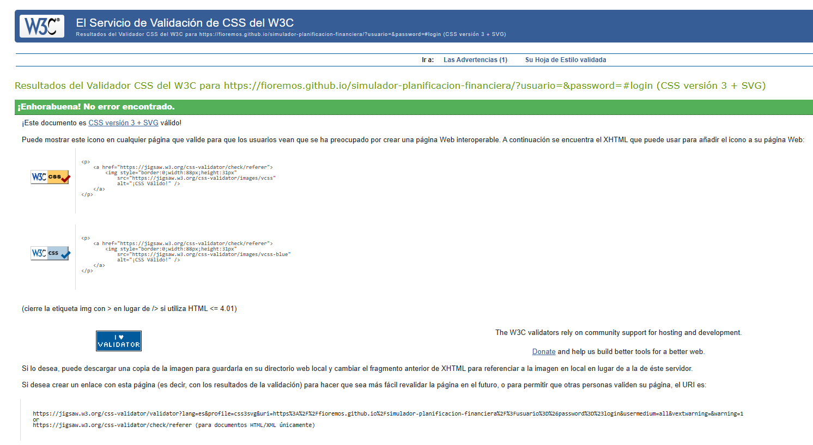
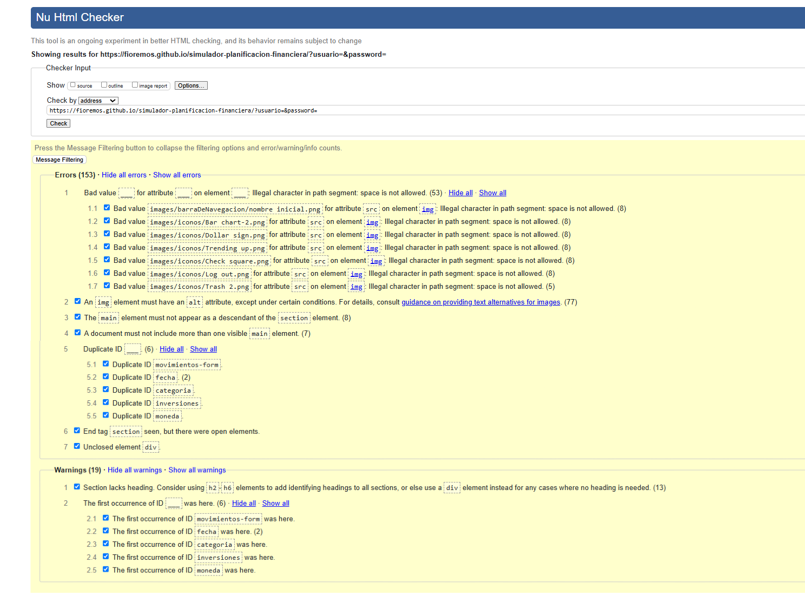

# Test Case 5: Cross-Platform y Validación CSS/HTML

## Objetivo
Verificar compatibilidad cross-platform y validar código CSS/HTML

## Herramientas Utilizadas
- LambdaTest Real Time Testing
- W3C CSS Validator
- W3C HTML Validator

## Testing Cross-Platform

### Windows 11
| Navegador | Versión | Resultado | Observaciones |
|-----------|---------|-----------|---------------|
| Chrome | 140 | ✅ | No se encontraron problemas de compatibilidad en la visualización. |
| Firefox | 143 | ✅ | No se encontraron problemas de compatibilidad en la visualización. |
| Edge | 140 | ✅ | No se encontraron problemas de compatibilidad en la visualización. |

### macOS
| Navegador | Versión | Resultado | Observaciones |
|-----------|---------|-----------|---------------|
| Safari | 18 | ❌ | En varias pantallas algunos elementos se sobresalen de los contenedores. Problema evidente en Dashboard e Inversiones. |
| Chrome |  | ⚠️ No probado | No se pudo realizar la prueba por limitaciones del plan gratuito de LambdaTest. Se asume comportamiento similar al de Windows, pero sin evidencia real. |
| Firefox |  | ⚠️ No probado | No se pudo realizar la prueba por limitaciones del plan gratuito de LambdaTest. Se asume comportamiento similar al de Windows, pero sin evidencia real. |

## Validación W3C

### CSS Validation Results
- **CSS Validator:** ✅ Valid CSS
- **Warnings:** ⚠️ 1

### HTML Validation Results
- **HTML Validator:** ❌ 153 errores
- **Warnings:** ⚠️ 19

## Compatibilidad CSS Features

| CSS Feature          | Chrome 140  | Firefox 143 | Safari (última) | Edge 140    |
| -------------------- | ----------- | ----------- | --------------- | ----------- |
| **Grid Layout**      | ✅ Soportado | ✅ Soportado | ✅ Soportado     | ✅ Soportado |
| **Flexbox**          | ✅ Soportado | ✅ Soportado | ✅ Soportado     | ✅ Soportado |
| **Backdrop-filter**  | ✅ Soportado | ✅ Soportado | ✅ Soportado     | ✅ Soportado |
| **Position: sticky** | ✅ Soportado | ✅ Soportado | ✅ Soportado     | ✅ Soportado |
