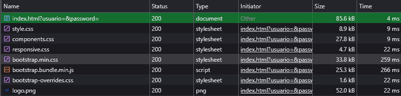

# Test Case 6: Responsive – Migración a Bootstrap

## Objetivo
Verificar la adaptabilidad responsive en dispositivos móviles, tablets y desktops tras la migración del proyecto a Bootstrap, asegurando que el diseño se mantenga coherente con el mockup `disenio-bootstrap.png`.

## Herramientas Utilizadas
- BrowserStack Real Device Testing
- Chrome DevTools Device Simulation
- Lighthouse / PageSpeed Insights

## Dispositivos Probados
| Dispositivo   | Resolución | Navegador | Orientación         | Resultado |
|---------------|------------|-----------|---------------------|-----------|
| iPhone 14 Pro | 393x852    | Safari    | Portrait/Landscape  | ✅/✅ |
| Galaxy S23    | 360x780    | Chrome    | Portrait/Landscape  | ✅/✅ |
| iPad Air      | 820x1180   | Safari    | Portrait/Landscape  | ✅/✅ |

## Breakpoints Verificados
- **Mobile:** 320px – 768px  
- **Tablet:** 768px – 1024px  
- **Desktop:** 1024px+  

## Capturas por Dispositivo

- **Samsung S23**
   - **Portrait** Coincide con el mockup  
         
   - **Landscape** Coincide con el mockup  
        
- **IPhone 14 Pro**
   - **Portrait** Coincide con el mockup  
         
   - **Landscape** Coincide con el mockup  
        
- **Ipad Air**
   - **Portrait** Coincide con el mockup  
         
   - **Landscape** Coincide con el mockup  
        

## Media Queries Validadas
- `[min-width: 320px]`  
- `[min-width: 768px]`  
- `[min-width: 1024px]` 

---

## Sistema de Grillas de Bootstrap
### Validaciones
- Se comprobó que las clases de Bootstrap utilizadas (col-, col-sm-, col-md-, col-lg-, etc.) se adaptan correctamente a las distintas resoluciones de pantalla, garantizando una distribución adecuada de los elementos en formato mobile, tablet y desktop.

- Se verificó además que no se produce scroll horizontal no deseado en dispositivos móviles, confirmando que el diseño es completamente responsive y se ajusta al ancho de la pantalla sin desbordes.

### Capturas esperadas
1. **Mobile (iPhone 14 Pro, ~393px ancho)**  
    
   - Captura de una sección con distribución en **una sola columna (`col-12`)**.  
   - No se produce scroll horizontal

2. **Tablet (iPad Air, ~820px ancho)**  
   
   - Captura mostrando la **redistribución en 2 o 3 columnas (`col-md-*`)**.  

3. **Desktop (>1024px)**  
   
   - Captura mostrando la distribución completa en múltiples columnas (`col-lg-*` o `col-xl-*`).  

---

## Performance en Mobile
### Validaciones
- Se realizaron mediciones de rendimiento utilizando Lighthouse/PageSpeed Insights, confirmando que la integración de Bootstrap no produjo un aumento significativo en el tiempo de carga ni afectó la puntuación general de desempeño del sitio.

- Se verificó el peso del archivo CSS cargado desde el CDN (bootstrap.min.css), constatando que su tamaño es óptimo y que no actúa como recurso bloqueante durante la renderización inicial de la página.

### Capturas esperadas
1. **Reporte de Lighthouse / PageSpeed**  
   
   
Antes de la integración, el sitio presentaba una puntuación de 100% en performance, mientras que luego de la incorporación de Bootstrap la calificación descendió levemente a 96%.

Esta variación se considera marginal y esperada, dado que la inclusión de la hoja de estilos de Bootstrap (bootstrap.min.css) agrega recursos externos que incrementan ligeramente el tiempo de carga inicial. 

2. **Detalle de recursos en Network (Chrome DevTools)**  
    
   
Se comprobó en la pestaña Network de Chrome DevTools que el archivo bootstrap.min.css, cargado desde el CDN, presenta un tamaño adecuado y no aparece como recurso bloqueante en la columna “Blocking”, confirmando que su carga no interfiere con el renderizado de la página.

---

## Resultado Esperado
- El layout debe adaptarse correctamente en **mobile, tablet y desktop** sin pérdida de coherencia visual.  
- No debe existir **scroll horizontal inesperado** en mobile.  
- El impacto en **performance** debe ser mínimo y el CSS de Bootstrap debe cargarse correctamente desde el CDN.

----
## Issues encontrados
Durante la ejecución de este test no se detectaron problemas, documentados en el repositorio