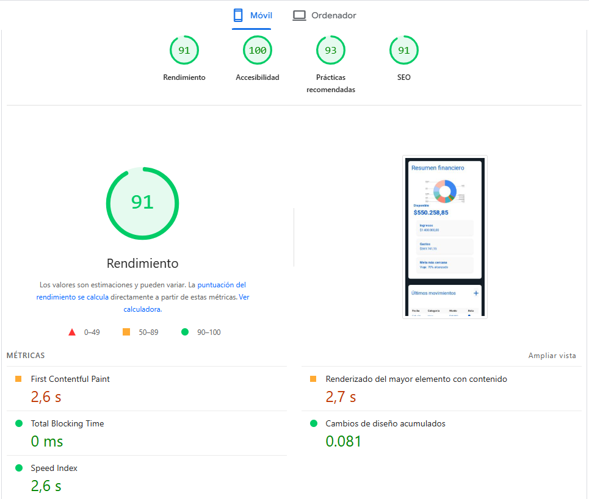

# Test Case 7: Responsive – Implementación de Componente Avanzado Bootstrap (Offcanvas)

## Objetivo
Verificar la correcta integración, personalización y comportamiento responsive del primer componente avanzado de Bootstrap seleccionado: __`Offcanvas` con menú lateral seleccionable__ en diferentes dispositivos.  

## Herramientas Utilizadas 
- Chrome DevTools Device Mode  
- Google PageSpeed Insights  

## Dispositivos Probados
| Dispositivo       | Resolución | Navegador | Orientación         | Resultado | Detalle |
|-------------------|------------|-----------|---------------------|-----------|---------|
| iPhone 14 Pro     | 393x852    | Safari    | Portrait/Landscape  | ✅/✅ | Visualización correcta en ambas orientaciones |
| Galaxy S23        | 360x780    | Chrome    | Portrait/Landscape  | ✅/✅ | Visualización correcta en ambas orientaciones |
| iPad Air          | 820x1180   | Safari    | Portrait/Landscape  | ✅/⚠️ | Si el offcanvas esta desplegado y pasas de portrait a landscape, el fondo queda oscuro y bloqueado |
| Desktop (Laptop)  | >1024px    | Chrome    | Landscape           | ✅ | El offcanvas se despliega en mobile y tablet |

## Breakpoints Verificados
- **Mobile:** 320px – 768px  
- **Tablet:** 768px – 1024px  
- **Desktop:** 1024px+  

---

## Validaciones específicas
- El componente se visualiza correctamente en todas las resoluciones.  
- No aparece scroll horizontal.  
- El menú lateral responde al clic/touch sin retraso.  
- Conserva el estilo general del sitio definido en `css/styles.css`, `css/components.css` y `css/bootstrap-overrides.css`.  

---

## Capturas esperadas

### iPhone 14 pro - Portrait  

### iPhone 14 pro - Landscape  

### Samsung Galaxy S23 - Portrait  

### Samsung Galaxy S23 - Landscape  

### iPad Air - Portrait  

### ipad Air - Landscape
En este caso el componente Offcanvas no se muestra debido a que se activa el sidebar fijo.

### Desktop  
En esta ocación el componente Offcanvas es visible en mobile y tablet ya que en desktop se despliega el sidebar.

### DevTools - Performance

---

## Performance en Mobile

### Score con la versión anterior
- Performance: 94 / 100  
- Accesibilidad: 100 / 100  
- Prácticas recomendadas: 93 / 100  
- SEO: 91 / 100  

### Score con la versión despues del componente
- Performance: 94 / 100  
- Accesibilidad: 100 / 100  
- Prácticas recomendadas: 96 / 100  
- SEO: 91 / 100 

### Captura del resultado global

### Resultados antes y despues de la incorpotación del componente 

### Accesibilidad - Antes

### Accesibilidad - Despues

### Practicas recomendadas - Antes

### Practicas recomendadas - Despues

### SEO - Antes

### SEO - Despues

### Sección de Insights y Diagnósticos de PageSpeed donde se evidencie si hay recursos de bloqueo de renderizado.
  

---

## Resultado Esperado
- El componente se adapta correctamente en todos los dispositivos y resoluciones.  
- Mantiene coherencia visual y estilo definido en los archivos CSS del proyecto.  
- No genera problemas de performance ni bloqueos de carga.  

---

## Issues encontrados
Registrar aquí los problemas detectados y su correspondiente issue en el repositorio:  

| IssueID | Descripción |
|---------|-------------|
| [#60](https://github.com/fioremos/simulador-planificacion-financiera/issues/60) | Si el offcanvas esta desplegado y pasas de portrait a landscape, el fondo queda oscuro y bloqueado (iPad air) |
