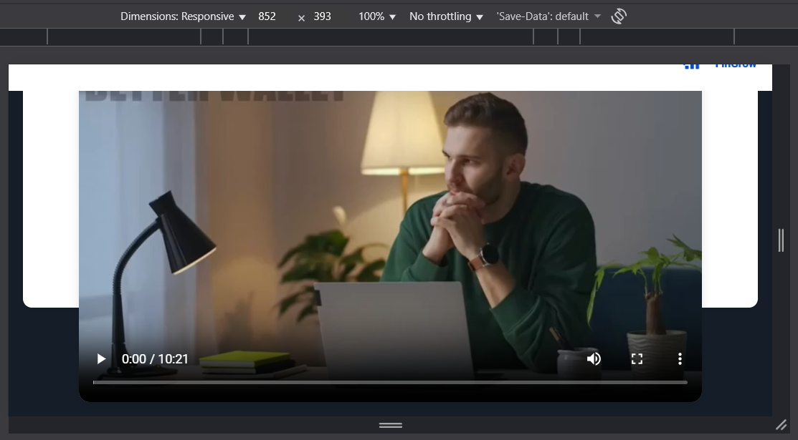
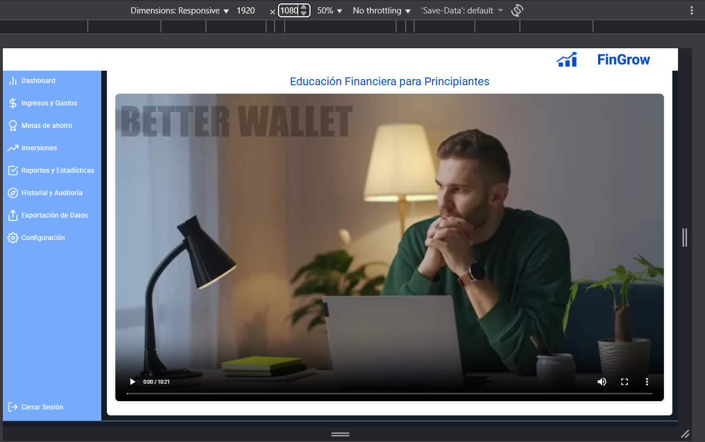

# Test Case 9: Responsive – Implementación de Componente Avanzado HTML (1)

## Objetivo
Validar la integración, compatibilidad y comportamiento responsive del primer componente avanzado HTML implementado: 
**elemento `<video>` con subtítulos track** en diferentes dispositivos.

## Herramientas Utilizadas
- Chrome DevTools Device Mode (simulación de dispositivos móviles y tablets)
- Google PageSpeed Insights (rendimiento y accesibilidad)
- Can I Use (verificación de compatibilidad por navegador)  
- W3C HTML Validator (validación de estándares HTML5)  

## Dispositivos Probados
| Dispositivo       | Resolución | Navegador | Orientación         | Resultado | Detalle |
|-------------------|------------|-----------|---------------------|-----------|---------|
| iPhone 14 Pro     | 393x852    | Safari    | Portrait/Landscape  | ✅/⚠️ | En modo landscape, el video se desborda levemente del contenedor. |
| Galaxy S23        | 360x780    | Chrome    | Portrait/Landscape  | ✅ |/⚠️ | En modo landscape, el video se desborda levemente del contenedor. |
| iPad Air          | 820x1180   | Safari    | Portrait/Landscape  | ✅ | Visualización correcta y centrada en ambas orientaciones. |
| Desktop (Laptop)  | >1024px    | Chrome    | Landscape           | ✅ | El componente se adapta perfectamente al layout y conserva proporciones. |

## Breakpoints Verificados
- **Mobile:** 320px – 768px  
- **Tablet:** 768px – 1024px  
- **Desktop:** 1024px+  

---

## Validaciones específicas
- El componente se adapta correctamente a los tres breakpoints.  
- No genera scroll horizontal indeseado.  
- Los controles de play, pause, interacción táctil y volumen funcionan correctamente. 
- Mantiene coherencia visual con el sistema de grillas de Bootstrap. 
- Conserva el estilo general del sitio definido en `styles.css` y `components.css`. 

---

## Uso de herramientas de compatibilidad y validación

- **Can I Use:** Compatibilidad de los elementos `<video>` y `<track>` en los principales navegadores:

  **Capturas necesarias:**  
  Pantalla de resultados de mostrando la tabla de soporte del componente.
  
    

| Componente | Compatibilidad Global | Navegadores compatibles | Limitaciones |
|------------|-----------------------|-------------------------|--------------|
|  `<video>`  | 96.37%  | Chrome, Edge, Safari, Firefox, Opera | Totalmente soportado, no requiere plugins.|
|  `<track> `  | 95.53%  | Chrome, Safari, Firefox, Edge  | No compatible con modo fullscreen en navegadores antiguos.|

- **W3C HTML Validator:** Validación del documento HTML tras la incorporación del componente:

  **Capturas necesarias:**  

 

 **Resultado general:**
  Se detectaron errores menores estructurales, relacionados con la organización del documento, no con los componentes avanzados implementados.

 | Tipo       | Descripción                                                                                   | Relevancia |
| ---------- | --------------------------------------------------------------------------------------------- | ---------- |
| ⚠️ Error   | Uso del elemento `<main>` dentro de varias `<section>` → No permitido por especificación.     | Medio      |
| ⚠️ Error   | Múltiples elementos `<main>` visibles en un mismo documento.                                  | Medio      |
| ⚠️ Error   | Atributo `alt` con comillas duplicadas (`alt="logo_tacho_borrar""`).                          | Bajo       |
| ⚠️ Error   | IDs duplicados (`movimientos-form`, `inversiones`).                                           | Medio      |
| ⚠️ Warning | Secciones sin encabezado `<h2>` o similar (por ejemplo, “dashboard”, “metas”, “inversiones”). | Bajo       |
| ⚠️ Error   | Elemento `
` sin cerrar dentro de la sección “configuración”.                             | Medio      |

---

## Performance en Mobile

- Resultados generales – Google PageSpeed Insights (Mobile)

 - Puntuaciones obtenidas:

 - Performance: 49 / 100

 - Accesibilidad: 95 / 100

 - Prácticas recomendadas: 93 / 100

 - SEO: 91 / 100

  **Capturas necesarias:**  

  Resultados del test de Google PageSpeed para **mobile**.
   

  
  
  

**Diagnóstico y Métricas**

| Métrica                        | Valor | Estado                   |
| ------------------------------ | ----- | ------------------------ |
| First Contentful Paint (FCP)   | 2.4 s | ⚠️ Lento                 |
| Largest Contentful Paint (LCP) | 2.9 s | ⚠️ Moderado              |
| Total Blocking Time (TBT)      | Alto  | ⚠️ Necesita optimización |
| Cumulative Layout Shift (CLS)  | 0.01  | ✅ Estable                |
 

  Sección de Insights y Diagnósticos de PageSpeed donde se evidencie si hay recursos de bloqueo de renderizado.

  

El componente `<video>` no afecta de forma crítica la performance global, aunque la página general requiere optimización en recursos estáticos y scripts bloqueantes. La accesibilidad y las prácticas recomendadas se mantienen en niveles sobresalientes.

---

## Capturas esperadas:

**Iphone 14 pro - Potrait**  

**Iphone 14 pro - Landscape**

**Samsung Galaxy S23 - Portait**

**Samsung Galaxy S23 - Landscape**

**iPad Air - Portait** 

**iPad Air - Landscape**

**Desktop**

  

---

## Resultado Esperado
- El componente HTML se adapta y funciona correctamente en todos los dispositivos probados.  
- Mantiene la coherencia del diseño e integración con Bootstrap.  
- No afecta de forma crítica la performance en mobile.  
- Es compatible con los principales navegadores según **Can I Use** y válido según **W3C HTML Validator**.  

---

## Issues encontrados
Registrar aquí los problemas detectados y su correspondiente issue en el repositorio:  

| IssueID | Descripción |
|---------|-------------|
| [#55](https://github.com/fioremos/simulador-planificacion-financiera/issues/55) | Video HTML5 se desborda del contenedor en landscape mobile |