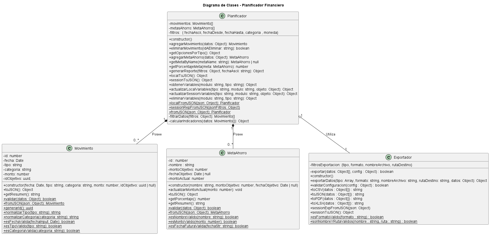

# Documentación Diagrama de Clases

Este diagrama define la arquitectura de lógica de negocio (POO) para el simulador de planificación financiera. Separa las responsabilidades en dos tipos de clases: modelos de dominio y un gestor central.



## Clases Identificadas

### 1. Movimiento
* **Responsabilidad:** Representa una única transacción financiera (ej. un ingreso o un gasto).
* **Propiedades:** Almacena los datos de la transacción (`fecha`, `tipo`, `categoria`, `monto`).
* **Métodos Clave:**
    * `validar(datos)`: Método estático para validar datos *antes* de crear una instancia. Mueve la lógica de `esFechaValida`, `esTipoValido`, etc.
    * `toJSON() / fromJSON()`: Métodos para la serialización (guardado/carga) con el Storage.
    * `generarId()`: Genera un ID único para el movimiento. 
    * `normalizarTipo(tipo)`: Normaliza el tipo a minúsculas y elimina espacios.
    * `normalizarCategoria(categoria)`: Normaliza la categoría a minúsculas y elimina espacios.
    * `getResumen()`: Genera un resumen legible del movimiento.

### 2. MetaAhorro
* **Responsabilidad:** Representa un único objetivo de ahorro.
* **Propiedades:** Almacena los datos del objetivo (`nombre`, `montoObjetivo`, `montoActual`).
* **Métodos Clave:**
    * `validar(datos)`: Método estático para validar datos *antes* de crear la instancia. Mueve la lógica de `esNombreValido`, `esFechaFuturaValida`, etc.
    * `actualizarMontoActual(monto)`: Permite incrementar el monto ahorrado hasta alcanzar el objetivo. Si el progreso supera el monto objetivo, se ajusta automáticamente al valor máximo permitido.
    * `toJSON() / fromJSON()`: Métodos para la serialización.
    * `generarId()`: Genera un ID único de la Meta de Ahorro.
    * `getPorcentaje()`: Devuelve un porcentaje alcanzado de la meta.
    * `getResumen()`: Genera un resumen legible de la meta.

### 3. Exportador
- **Responsabilidad:** Gestiona el proceso de exportación de datos financieros del sistema hacia distintos formatos (CSV, JSON y PDF). Se encarga de validar las configuraciones de exportación, generar el contenido adecuado según el formato solicitado y simular la creación del archivo final en la ruta destino. 
* **Propiedades:**
    * `filtrosExportacion:{tipo, formato, nombreArchivo, rutaDestino}`: Diccionario con los filtros de la última exporación realizada.
- **Métodos Clave:**
  * `exportarDatos(tipo, formato, nombreArchivo, rutaDestino)`: Procesa los datos de la app para exportación.
  - `exportar(datos, config)`: Método principal que valida los parámetros y ejecuta la exportación.  
  - `validarConfiguracion(config)`: Comprueba que la configuración de exportación sea válida, incluyendo formato, nombre y ruta.
Internamente usa los métodos estáticos `esFormatoValido()`, `sonNombreYRutaValidos()`.   
  - `toCSV(datos)`: Convierte los datos en una representación de texto plano con formato CSV.  
  - `toJSON(datos)`: convierte los datos a un string JSON.  
  - `toPDF(datos)`: Genera un contenido en formato PDF.
  - `toXLSX(datos)`: Convierte los datos en una hoja de cálculo Excel.
  - `esFormatoValido(formato)`:Método estático que comprueba si el formato indicado está dentro de los formatos permitidos.   
  - `sonNombreYRutaValidos(nombre, ruta)`: Método estático que verifica que el nombre de archivo y la ruta sean correctos y seguros.
  * `sessionToJSON()`: Serializa los filtros del exportador.
  * `sessionEpFromJSON(jsonFiltrosExp)`: Carga los filtros del exportador desde un objeto JSON.

### 4. Planificador
* **Responsabilidad:** Es la clase principal y el "cerebro" de la aplicación. Orquesta la lógica de negocio y gestiona las listas de movimientos y metas.
* **Propiedades:**
    * `movimientos: Movimiento[]`: Lista que contiene todas las instancias de `Movimiento`.
    * `metas: MetaAhorro[]`: Lista que contiene todas las instancias de `MetaAhorro`.
    * `filtros: { fechaAscii, fechaDesde, fechaHasta, categoria , moneda}`: Diccionario del último filtro útilizado para generar un reporte.
* **Métodos Públicos (Interfaz):**
    * `agregarMovimiento(datos)`: Valida datos, crea un `Movimiento` y lo añade a la lista.
    * `eliminarMovimiento(idAEliminar)`: Elimina un `Movimiento` por su ID.
    * `getOpcionesPorTipo()`: Indica como son la relaciones entre categorias y tipos.
    * `agregarMetaAhorro(datos)`: Valida datos, crea una `MetaAhorro` y la añade a la lista.
    * `getMetaByName(metaName)`: Obtiene una `MetaAhorro` del arerglo metas de Ahorro por nombre.
    * `getPorcentajeMeta(meta)`: Devuelve un porcentaje acanzado de una `MetaAhorro`.
    * `generarReporte(filtros)`: Procesa la lista de movimientos y devuelve un objeto con los resultados.
    * `localToJSON()`: Serializa movimientos y metas al formato JSON.
    * `sessionToJSON()`: Serializa los filtros de reporte.
    * `localFromJSON(json)`: Crea una instancia de Planificador desde datos almacenados localmente.
    * `sessionRepFromJSON(jsonFiltros)`: Carga filtros de sesión en el planificador.
    * `obtenerVariables(modulo, tipo)`: Carga las variables si existen.
    * `actualizarLocalVariables(tipo, modulo, objeto)`: Actualiza las variables locales existentes.
    * `actualizarSessionVariables(tipo, modulo, objeto)`: Actualiza las variables de sesion existentes.
    * `eliminarVariables(modulo, tipo)`: Elimina las variables existentes.
* **Métodos Privados (Lógica Interna):**
    * `filtrarDatos(...)`: Lógica migrada de la función global `filtrarDatos`.
    * `calcularIndicadores(...)`: Lógica migrada de la función global `calcularIndicadores`.

## Relaciones

* **Planificador `*--` Movimiento (Composición):** El `Planificador` "posee" una colección de 0 o más (`0..*`) `Movimientos`. Esta relación es de composición porque los movimientos son parte integral del estado del planificador.
* **Planificador `*--` MetaAhorro (Composición):** El `Planificador` también "posee" una colección de 0 o más (`0..*`) `MetasAhorro`.
* **Planificador `*--` Exportador (Composición):** El `Planificador` incorpora internamente un objeto `Exportador`, al cual delega la responsabilidad de gestionar la exportación de datos. Esta relación refuerza el principio de responsabilidad única y desacopla la lógica de negocio del manejo de archivos.


## Persistencia y Serialización de Datos

Cada clase del modelo de dominio implementa métodos de **serialización** (`toJSON()`) y **deserialización** (`fromJSON()`) que permiten transformar las instancias en estructuras planas o cadenas JSON.  
Esto facilita el almacenamiento y recuperación del estado de la aplicación mediante `localStorage`, archivos locales o exportaciones JSON.

### Objetivos

- **Estandarizar el formato** de guardado y carga de datos entre todas las clases.
- **Desacoplar la lógica de negocio del almacenamiento**, evitando dependencias directas con el navegador o APIs externas.
- **Garantizar la integridad** y reconstrucción correcta de las instancias del modelo.

### Implementación por Clase

| Clase | Método | Descripción |
|--------|---------|-------------|
| **Movimiento** | `toJSON()` | Convierte la instancia en un objeto plano con sus propiedades (`fecha`, `tipo`, `categoria`, `monto`). |
|  | `fromJSON(json)` | Método estático que reconstruye una instancia de `Movimiento` desde un objeto previamente serializado. |
| **MetaAhorro** | `toJSON()` | Serializa la meta con sus propiedades (`nombre`, `montoObjetivo`, `montoActual`, `fechaObjetivo`). |
|  | `fromJSON(json)` | Crea una nueva instancia de `MetaAhorro` a partir de un objeto JSON cargado. |
| **Planificador** | `localtoJSON()` | Serializa el estado completo del planificador, incluyendo listas de movimientos y metas. |
|  | `localFromJSON(json)` | Reconstruye un `Planificador` con sus colecciones internas, utilizando los métodos `fromJSON()` de `Movimiento` y `MetaAhorro`. |
| **Planificador** | `sessiontoJSON()` | Serializa los filtros de generación de reporte. |
|  | `sessionFromJSON(json)` | Reconstruye el estado del reporte generado restaurando los filtros de generación de reporte. |
| **Exportador** | `sessionToJSON()` | Serializa los filtros de exportación del exportador. |
|  | `sessionExpFromJSON(json)` | Reconstruye el estado del exportador restaurando los filtros de exportación. |

**Ejemplo de uso con Local Storage:**
 ```js
 // Guardar estado actual
 localStorage.setItem('planificador', JSON.stringify(planificador.toJSON()));

 // Restaurar estado al iniciar la app
 const data = JSON.parse(localStorage.getItem('planificador'));
 const planificador = Planificador.fromJSON(data);
 ```

