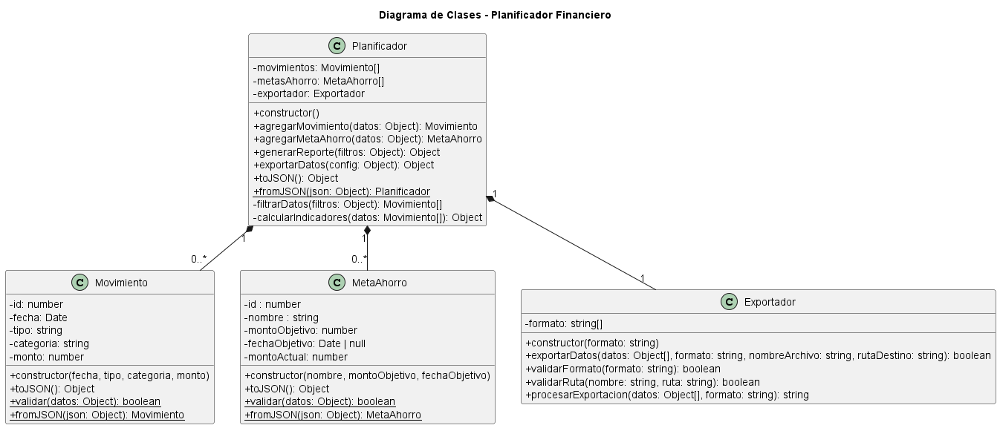

# Documentación Diagrama de Clases

Este diagrama define la arquitectura de lógica de negocio (POO) para el simulador de planificación financiera. Separa las responsabilidades en dos tipos de clases: modelos de dominio y un gestor central.

## Clases Identificadas

### 1. Movimiento
* **Responsabilidad:** Representa una única transacción financiera (ej. un ingreso o un gasto).
* **Propiedades:** Almacena los datos de la transacción (`fecha`, `tipo`, `categoria`, `monto`).
* **Métodos Clave:**
    * `validar(datos)`: Método estático para validar datos *antes* de crear una instancia. Mueve la lógica de `esFechaValida`, `esTipoValido`, etc.
    * `toJSON() / fromJSON()`: Métodos para la serialización (guardado/carga) con el Storage.

### 2. MetaAhorro
* **Responsabilidad:** Representa un único objetivo de ahorro.
* **Propiedades:** Almacena los datos del objetivo (`nombre`, `montoObjetivo`, `montoActual`).
* **Métodos Clave:**
    * `validar(datos)`: Método estático para validar datos *antes* de crear la instancia. Mueve la lógica de `esNombreValido`, `esFechaFuturaValida`, etc.
    * `actualizarMontoActual(monto)`: Permite incrementar el monto ahorrado hasta alcanzar el objetivo. Si el progreso supera el monto objetivo, se ajusta automáticamente al valor máximo permitido.
    * `toJSON() / fromJSON()`: Métodos para la serialización.

### 3. Exportador
- **Responsabilidad:** Gestiona el proceso de exportación de datos financieros del sistema hacia distintos formatos (CSV, JSON y PDF). Se encarga de validar las configuraciones de exportación, generar el contenido adecuado según el formato solicitado y simular la creación del archivo final en la ruta destino. 
- **Métodos Clave:**
  - `exportar(datos, config)`: Método principal que valida los parámetros y ejecuta la exportación.  
  - `validarConfiguracion(config)`: Comprueba que la configuración de exportación sea válida, incluyendo formato, nombre y ruta.
Internamente usa los métodos estáticos `esFormatoValido()`, `sonNombreYRutaValidos()`.   
  - `toCSV(datos)`: Convierte los datos en una representación de texto plano con formato CSV.  
  - `toJSON(datos)`: convierte los datos a un string JSON.   
  - `esFormatoValido(formato)`:Método estático que comprueba si el formato indicado está dentro de los formatos permitidos.   
  - `sonNombreYRutaValidos(nombre, ruta)`: Método estático que verifica que el nombre de archivo y la ruta sean correctos y seguros.

### 4. Planificador
* **Responsabilidad:** Es la clase principal y el "cerebro" de la aplicación. Orquesta la lógica de negocio y gestiona las listas de movimientos y metas.
* **Propiedades:**
    * `movimientos: Movimiento[]`: Lista que contiene todas las instancias de `Movimiento`.
    * `metas: MetaAhorro[]`: Lista que contiene todas las instancias de `MetaAhorro`.
    * `exportador: Exportador`: Componente interno encargado de gestionar la exportación de datos.
* **Métodos Públicos (Interfaz):**
    * `agregarMovimiento(datos)`: Valida datos, crea un `Movimiento` y lo añade a la lista.
    * `agregarMetaAhorro(datos)`: Valida datos, crea una `MetaAhorro` y la añade a la lista.
    * `generarReporte(filtros)`: Procesa la lista de movimientos y devuelve un objeto con los resultados.
    * `exportarDatos(tipo, formato, nombreArchivo, rutaDestino)`: Procesa los datos de la app para exportación.
* **Métodos Privados (Lógica Interna):**
    * `filtrarDatos(...)`: Lógica migrada de la función global `filtrarDatos`.
    * `calcularIndicadores(...)`: Lógica migrada de la función global `calcularIndicadores`.

## Relaciones

* **Planificador `*--` Movimiento (Composición):** El `Planificador` "posee" una colección de 0 o más (`0..*`) `Movimientos`. Esta relación es de composición porque los movimientos son parte integral del estado del planificador.
* **Planificador `*--` MetaAhorro (Composición):** El `Planificador` también "posee" una colección de 0 o más (`0..*`) `MetasAhorro`.
* **Planificador `*--` Exportador (Composición):** El `Planificador` incorpora internamente un objeto `Exportador`, al cual delega la responsabilidad de gestionar la exportación de datos. Esta relación refuerza el principio de responsabilidad única y desacopla la lógica de negocio del manejo de archivos.