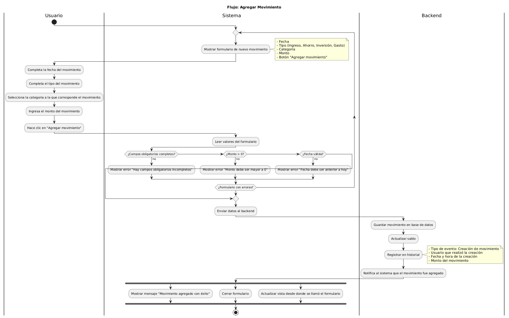
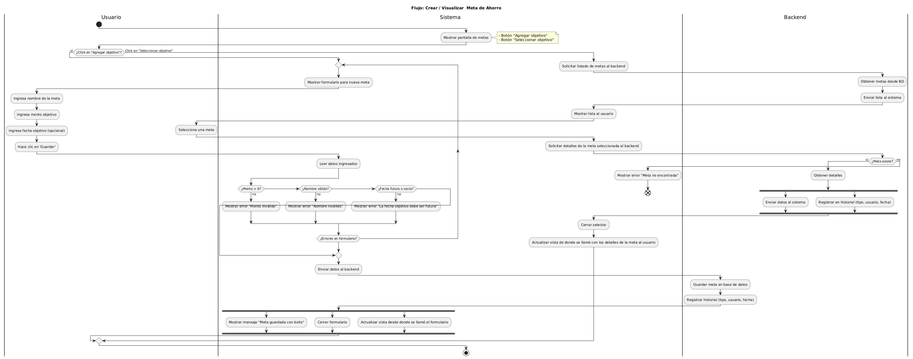
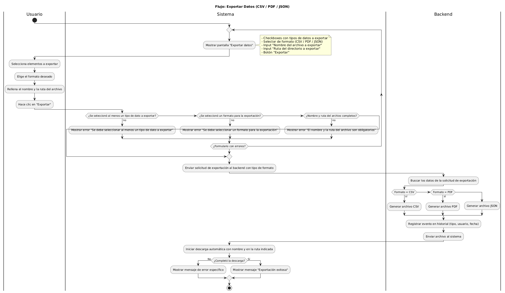
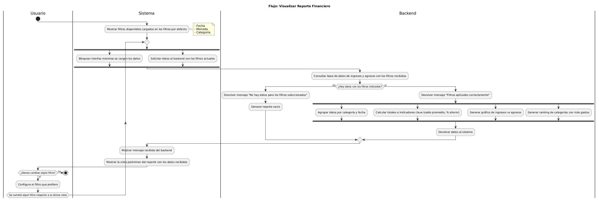

# Diagramas del Simulador de Planificación Financiera

Este documento reúne los **cuatro diagramas de actividad** desarrollados para representar los flujos principales del simulador financiero.  
Cada diagrama fue creado en **PlantUML** y refleja la lógica que será implementada en `script.js`.

## Índice de Diagramas
1. [Diagrama de Agregar Movimiento](01-diagrama-de-actividades/actividad-flujo-1-agregar-movimiento.png)
2. [Diagrama de Metas de Ahorro](01-diagrama-de-actividades/actividad-flujo-2-metas-ahorro.png)
3. [Diagrama de Exportación de Datos](01-diagrama-de-actividades/actividad-flujo-3-exportar-datos.png)
4. [Diagrama de Reportes y Estadísticas](01-diagrama-de-actividades/actividad-flujo-4-reportes-y-estadisticas.png)

## Diagrama de Agregar Movimiento

**Descripción:**  
Representa el flujo en el que el usuario agrega un nuevo movimiento financiero, completando los campos de tipo, monto, fecha y categoría. Este flujo puede iniciarse desde el *dashboard*, en la tarjeta de "Últimos movimientos", a través del botón "+", o desde la pantalla de Ingresos y Gastos.

**Archivos:**  
- [Ver archivo .puml](01-diagrama-de-actividades/actividad-flujo-1-agregar-movimiento.puml)

**Vista previa:**  


## Diagrama de Metas de Ahorro

**Descripción:**  
Muestra el proceso para crear o visualizar una meta de ahorro desde la pantalla de "Metas de ahorro". Incluye validaciones de monto, progreso y fecha estimada.

**Archivos:**  
- [Ver archivo .puml](01-diagrama-de-actividades/actividad-flujo-2-metas-ahorro.puml)

**Vista previa:**  


## Diagrama de Exportación de Datos

**Descripción:**  
Flujo de exportación de la información del simulador a formatos CSV o PDF. El usuario selecciona el formato, el sistema genera el archivo correspondiente y registra la acción en el historial.

**Archivos:**  
- [Ver archivo .puml](01-diagrama-de-actividades/actividad-flujo-3-exportar-datos.puml)

**Vista previa:**  


## Diagrama de Reportes y Estadísticas

**Descripción:**  
Refleja la generación de la pantalla de reportes financieros en base a filtros seleccionados por el usuario o cargados por defecto. El sistema calcula indicadores, muestra gráficos y permite exportar los resultados.

**Archivos:**  
- [Ver archivo .puml](01-diagrama-de-actividades/actividad-flujo-4-reportes-y-estadisticas.puml)

**Vista previa:**  


---

## Instrucciones para Edición de Diagramas PlantUML en Visual Studio Code

Para editar los diagramas PlantUML en Visual Studio Code, sigue estos pasos:

1. **Instala las extensiones necesarias:**
   - PlantUML

2. **Requisitos para renderizar:**

   **Opción local:**  
   Debes instalar previamente:
   - Java Runtime Environment (JRE)
   - GraphViz (para renderizar los diagramas)

   **Opción con servidor:**  
   - Presiona `Ctrl+P` para abrir el buscador de comandos.
   - Busca y selecciona: `Preferences: Open User Settings (JSON)`.
   - Agrega al final del archivo JSON los siguientes atributos:

     ```json
     "plantuml.render": "PlantUMLServer",
     "plantuml.server": "http://www.plantuml.com/plantuml"
     ```

3. **Para editar un diagrama:**
   - Abre el archivo `.puml` correspondiente.
   - La vista previa se actualizará automáticamente mientras editas.
   - Usa `Alt+D` para abrir la vista previa en una ventana separada.

4. **Para exportar un diagrama:**
   - Haz clic derecho en el editor del archivo `.puml`.
   - Selecciona “Export Current File Diagrams”.
   - Elige el formato de salida (PNG, SVG, etc.).

5. **Comandos útiles:**
   - `Alt+D`: Abrir vista previa.
   - `Ctrl+Shift+P`: Abrir paleta de comandos y buscar "PlantUML: Export Current File Diagrams".

6. **Recurso Web:**
   - [Tutorial en YouTube](https://www.youtube.com/watch?v=OEB3Kw40AzU)
