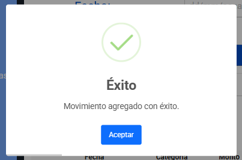
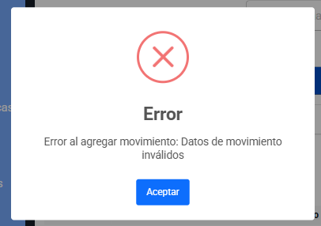
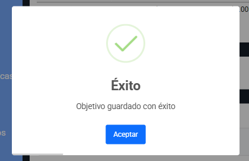
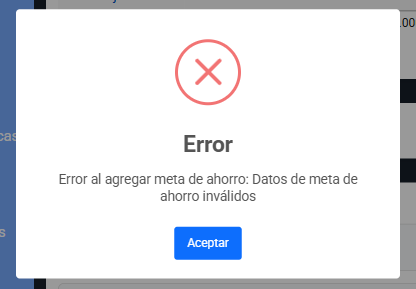
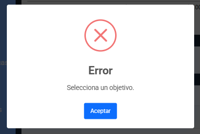
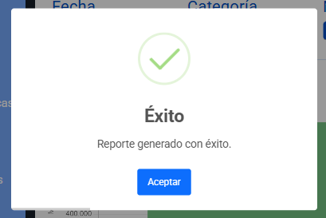
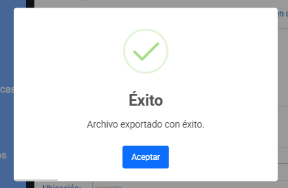
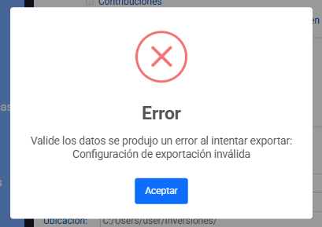

# Documentación de Librería Externa - SweetAlert2

## Información General  
- **Nombre:** SweetAlert2  
- **Versión:** 11.26.3  
- **Repositorio:** https://github.com/sweetalert2/sweetalert2  
- **Documentación oficial:** https://sweetalert2.github.io  

## Propósito y Justificación  
La librería **SweetAlert2** fue seleccionada para este proyecto debido a la necesidad de ofrecer un sistema de notificaciones claro, moderno y visualmente consistente que mejore la comunicación con el usuario durante las operaciones críticas de la aplicación. El flujo del sistema requiere informar al usuario sobre la creación, actualización o falla en procesos relacionados con **movimientos financieros**, **metas de ahorro**, **exportación de datos** y **generación de reportes**, situaciones en las cuales la retroalimentación inmediata es esencial.  

Desde una perspectiva técnica, el proyecto originalmente utilizaba alertas nativas del navegador (``alert()``, ``confirm()``, ``prompt()``), las cuales presentan varias limitaciones:  
- No permiten estilos personalizados ni coherencia visual con el diseño general del sitio.  
- No ofrecen variaciones para distintos tipos de estado (éxito, error, advertencia, información).  
- No permiten incluir contenido HTML, iconografía avanzada o automatizar cierres.  
- No son accesibles para todos los usuarios.  

SweetAlert2 soluciona estos problemas al proveer un sistema de alertas asíncrono, estético, configurable, no bloqueante y altamente compatible con aplicaciones web modernas.  

Además, usar esta librería mejora la experiencia del usuario (UX) al brindar respuestas claras, con colores, iconos y animaciones que ayudan a interpretar fácilmente el estado de una operación. Esto reduce la fricción, evita confusiones y mejora la percepción general del sistema.  

## Instalación e Integración 

### Método utilizado: CDN 
```html 
<script src="https://cdn.jsdelivr.net/npm/sweetalert2@11.14.0/dist/sweetalert2.all.min.js"></script>

<link href="https://cdn.jsdelivr.net/npm/sweetalert2@11.14.0/dist/sweetalert2.min.css" rel="stylesheet">
 
``` 

## Uso en el Proyecto  

### Caso de Uso 1: Alerta de éxito/error 
Fragmento de código para alerta de éxito. [Link de referencia](/js/utils/alerts.js#L27) 
```js
/**
 * Muestra una alerta de éxito.
 * @param {string} title - Título del mensaje.
 * @param {string} [message=''] - Mensaje detallado (opcional).
 * @param {Function} [callback=null] - Función a ejecutar después de cerrar (opcional).
 * @returns {Promise} Promesa de SweetAlert2.
 */
const success = (title, message = '', callback = null) => {
    return Swal.fire({
        ...defaultConfig,
        icon: 'success',
        title: title,
        text: message,
        confirmButtonText: 'Aceptar',
        timer: 2000,
        timerProgressBar: true
    }).then((result) => {
        if (callback && result.isConfirmed) callback();
        return result;
    });
};
```  

Fragmento de código para alerta de error. [Link de referencia](/js/utils/alerts.js#L49)
```js
/**
 * Muestra una alerta de error.
 * @param {string} title - Título del mensaje.
 * @param {string} [message=''] - Mensaje detallado (opcional).
 * @param {Function} [callback=null] - Función a ejecutar después de cerrar (opcional).
 * @returns {Promise} Promesa de SweetAlert2.
 */
const error = (title, message = '', callback = null) => {
    return Swal.fire({
        ...defaultConfig,
        icon: 'error',
        title: title,
        text: message,
        confirmButtonText: 'Aceptar'
    }).then((result) => {
        if (callback && result.isConfirmed) callback();
        return result;
    });
};
```  

### Caso de Uso 2: Función setFeedback 
Fragmento de código sobre la función que maneja las alertas. [Link de referencia](/js/script.js#L1000)  
```js
/**
 * Muestra un mensaje de feedback (éxito o error) usando SweetAlert2.
 * 
 * @param {string|Error} message - Mensaje a mostrar.
 * @param {boolean} isError - Si es true, se trata de un mensaje de error.
 * @param {Function} [callback=null] - Función a ejecutar después de cerrar (opcional).
 */
function setFeedback(message, isError = false, callback = null) {
    const title = isError ? 'Error' : 'Éxito';
    const messageText = message instanceof Error ? message.message : String(message);

    if (isError) {
        AlertUtils.error(title, messageText, callback);
    } else {
        AlertUtils.success(title, messageText, callback);
    }
}
```  

### Caso de Uso 3: Agregar Movimiento con éxito
Se llama a la función `setFeedback()` y se pasa el mensaje que se desea visualizar y "false" para indicar que no es un error. [Link de referencia](/js/script.js#L357)  
```js
try {
    const movimiento = planificador.agregarMovimiento(datos);
    planificador.actualizarLocalVariables('planificador', 'planificador', null);
    setFeedback('Movimiento agregado con éxito.', false);
    crearFilaMovimiento(datos, movimiento);
}
```  

### Caso de Uso 4: Error al exportar datos 
Se llama a la función `setFeedback()` que captura el error y visualiza el mensaje que devuelve el metodo `exportarDatos()` y "true" para indicar que es un error. [Link de referencia](/js/script.js#L415)  
```js
try {
    exportador.exportarDatos(tipoDatos, formato, nombre, ubicacion , planificador);
    planificador.actualizarSessionVariables('exportador', 'exportador:config', exportador);
    setFeedback('Archivo exportado con éxito.', false);
} catch (error) {
    setFeedback(error, true);
}
```   

Mensaje cuando ocurre un error en `exportarDatos()`. [Link de referencia](/js/models/Exportador.js#L39)  
```js
exportarDatos(tipo, formato, nombreArchivo, rutaDestino, planificador) {
    const datos =
        tipo.length === 1 && tipo[0] === 'resumen-cuenta'
        ? planificador.movimientos.map(m => m.toJSON())
        : planificador.metasAhorro.map(m => m.toJSON());

    const config = { tipo, formato, nombreArchivo, rutaDestino };

    try {
        this.#exportar(datos, config);
        console.log('Exportación exitosa.');
        return true;
    } catch (error) {
        throw new Error('Valide los datos se produjo un error al intentar exportar: '+ error.message);
    }
}
```  

## Capturas de Pantalla 

### Ingresos y Gastos
   
  

### Metas de ahorro
  
  

#### Objetivo de metas de ahorro
  

### Reportes y Estadística
  

### Exportación de Datos
  
  