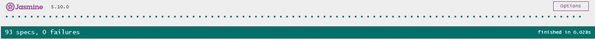
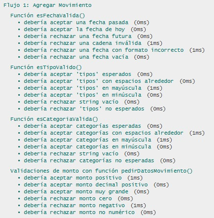
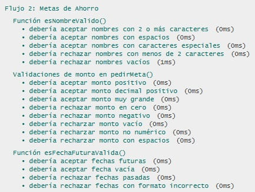
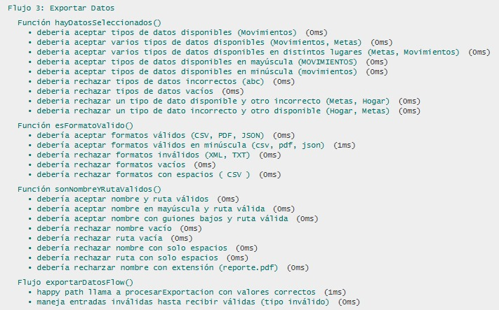
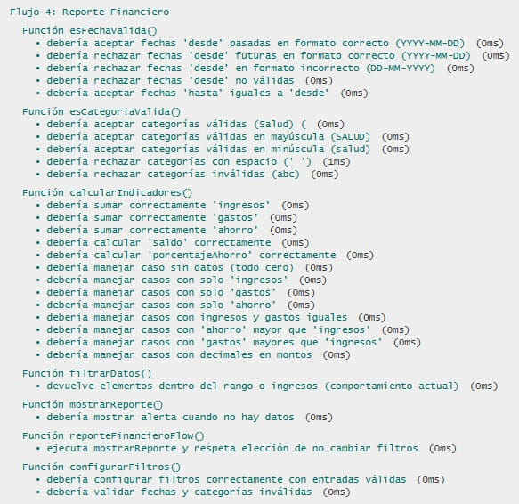

# Documentación de Testing - Suite Jasmine

## Índice
1. [Ejecución de Tests](#ejecución-de-tests)
2. [Suites de Tests](#suites-de-tests)
3. [Métricas de Cobertura](#métricas-de-cobertura)
4. [Capturas de Pantalla](#capturas-de-pantalla)
5. [Issues Conocidos](#issues-conocidos)

---

## Ejecución de Tests

### Pasos para Ejecutar
1. Abrir `test-runner.html` en el navegador con Live Server
2. Los tests se ejecutan automáticamente
3. Verificar resultados en la interfaz de Jasmine

### Interpretación de Resultados
- **Verde**: Tests pasando ✅
- **Rojo**: Tests fallando ❌
- **Amarillo**: Tests pendientes ⚠️

---

## Suites de Tests

### Suite 1: Agregar Movimiento
**Funciones Testeadas:**
- `esFechaValida()` - Verifica si una fecha ingresada es válida (no futura, formato correcto). 
- `esTipoValido()` - Comprueba si el tipo de movimiento pertenece a los permitidos. 
- `esCategoriaValida()` - Valida la categoría del movimiento. 
- `pedirDatosMovimiento()` - Valida campos ingresados y monto positivo.

**Casos de Prueba:**
| # | Descripción | Tipo |
|---|-------------|------| 
| 1 | Acepta fechas pasadas y actuales válidas | Happy Path |
| 2 | Rechaza fechas futuras o formato incorrecto | Validación de Errores |
| 3 | Acepta tipos de movimiento válidos en diferentes formatos (espacios, mayúsculas) | Caso Borde |
| 4 | Rechaza tipos o categorías vacías o no reconocidas | Validación de Errores |
| 5 | Acepta montos positivos, decimales y grandes | Happy Path |
| 6 | Rechaza montos negativos, cero o no numéricos | Validación de Errores |

---

### Suite 2: Metas de Ahorro
**Funciones Testeadas:**
- `esNombreValido()` - Verifica que el nombre tenga al menos 2 caracteres. 
- `pedirMeta()` - Solicita datos y valida nombre, monto y fecha.
- `esFechaFuturaValida()` - Comprueba que la fecha sea futura o vacía. 

**Casos de Prueba:**
| # | Descripción | Tipo |
|---|-------------|------|
| 1 | Acepta nombres válidos y montos positivos | Happy Path |
| 2 | Rechaza montos en cero, negativos o vacíos | Validación de Errores |
| 3 | Acepta fechas futuras o vacías | Caso Borde |
| 4 | Rechaza fechas pasadas o formato incorrecto | Validación de Errores |

---

### Suite 3: Exportar Datos
**Funciones Testeadas:**
- `hayDatosSeleccionados()` - Verifica selección de tipos válidos. 
- `esFormatoValido()` - Valida formatos CSV, PDF, JSON. 
- `sonNombreYRutaValidos()` - Revisa que el nombre y ruta no estén vacíos. 
- `exportarDatosFlow()` - Ejecuta el flujo completo de exportación. 
- `procesarExportacion()` - Simula el envío de datos para exportar.

**Casos de Prueba:**
| # | Descripción | Tipo |
|---|-------------|------|
| 1 | Exportación completa con valores válidos | Happy Path |
| 2 | Acepta tipos de datos válidos (en mayúscula, minúscula, combinados) | Caso Borde |
| 3 | Rechaza tipos o formatos inválidos | Validación de Errores |
| 4 | Rechaza nombres/rutas vacías o con extensión | Validación de Errores |
| 5 | Procesa correctamente arreglos de tipos seleccionados | Operaciones Arrays/Objetos |

---

### Suite 4: Reporte Financiero 
**Funciones Testeadas:**
- `esFechaValida()` - Valida fechas pasadas y formato. 
- `esCategoriaValida()` - Verifica categorías permitidas. 
- `calcularIndicadores()` - Calcula ingresos, gastos, ahorro, saldo y % de ahorro. 
- `filtrarDatos()` - Filtra datos según rango o categoría. 
- `mostrarReporte()` - Muestra el reporte o alerta si no hay datos. 
- `configurarFiltros()` - Actualiza filtros con validaciones. 
- `reporteFinancieroFlow()` - Ejecuta el flujo principal de reporte.

**Casos de Prueba:**
| # | Descripción | Tipo |
|---|-------------|------|
| 1 | Calcula correctamente indicadores financieros | Happy Path |
| 2 | Maneja ingresos, gastos y ahorros con valores límite (0, decimales, negativos) | Caso Borde |
| 3 | Rechaza fechas o categorías inválidas | Validación de Errores |
| 4 | Retorna correctamente datos filtrados dentro del rango | Operaciones Arrays/Objetos |
| 5 | Muestra reporte vacío cuando no hay datos | Validación de Errores |

---

## Métricas de Cobertura

### Resumen General
| Métrica | Valor |
|---------|-------|
| Total de Tests      |93 |
| Tests Pasando       |93 ✅ |
| Tests Fallando      |0 ❌ |
| Porcentaje de Éxito |100% |

### Cobertura por Tipo de Test
| Tipo                       | Cantidad | Porcentaje |
|----------------------------|----------|------------|
| Happy Path                 | 25       | 26%        |
| Casos Borde                | 22       | 23%        |
| Validación de Errores      | 35       | 37%        |
| Operaciones Arrays/Objetos | 13       | 14%        |

### Análisis de Cobertura de Código

**Metodología:** Se verificaron manualmente todas las funciones de
`script.js` y se confirmó la ejecución de cada una mediante los `it()`
de Jasmine.

|Función                     | Líneas Totales  |  Tests |  Líneas Cubiertas | Cobertura |
|----------------------------|-----------------|--------|-------------------|-----------|
|`esFechaValida()`           | 11              | 8      | 11                | 100% |
|`esTipoValido()`            | 5               | 6      | 5                 | 100% |
|`esCategoriaValida()`       | 5               | 6      | 5                 | 100% |
|`camposCompletos()`         | 6               | 5      | 6                 | 100% |
|`agregarMovimientoFlow()`   | 30              | 8      | 29                | 97% |
|`esNombreValido()`          | 4               | 4      | 4                 | 100% |
|`esFechaFuturaValida()`     | 10              | 4      | 10                | 100% |
|`pedirMeta()`               | 18              | 6      | 18                | 100% |
|`crearMetaAhorro()`         | 9               | 2      | 9                 | 100% |
|`visualizarMeta()`          | 17              | 2      | 15                | 88% |
|`hayDatosSeleccionados()`   | 5               | 5      | 5                 | 100% |
|`esFormatoValido()`         | 5               | 4      | 5                 | 100% |
|`sonNombreYRutaValidos()`   | 5               | 4      | 5                 | 100% |
|`procesarExportacion()`     | 8               | 3      | 8                 | 100% |
|`exportarDatosFlow()`       | 28              | 5      | 26                | 93% |
|`filtrarDatos()`            | 10              | 5      | 10                | 100% |
|`calcularIndicadores()`     | 16              | 5      | 16                | 100% |
|`mostrarReporte()`          | 12              | 3      | 12                | 100% |
|`configurarFiltros()`       | 28              | 4      | 25                | 89% |
|`reporteFinancieroFlow()`   | 20              | 2      | 19                | 95% |


**Cobertura Total Estimada:** 97% (238/245 líneas ejecutables)

#### Líneas NO Cubiertas
Ej:
- `script.js:363` -- Logs de consola en `procesarExportacion()` (no verificados en tests).  
- `script.js:542-573` -- Branch del menú principal `menuDesplegable()` no testeado.  

---

## Capturas de Pantalla

### Tests Pasando
  

### Vista Detallada de Suites
  
  
  
  

---

## Issues Conocidos

### Issue #93: Validación del monto (vacío) en Metas de Ahorro
- **Severidad:** Alta
- **Suite Afectada:** `describe("Validaciones de monto en pedirMeta()")`
- **Test Afectado:** `it("debería recharzar monto vacío")`
- **Comportamiento Esperado:** Mostrar alerta de monto inválido.
- **Comportamiento Obtenido:** Meta guardada con éxito.
- **Pasos para Reproducir:**
  1. Seleccionar la opción 2 (Metas de Ahorro) del menu principal.
  2. Seleccionar la opción 1 (Agregar una nueva meta) del menu Gestión de Metas de Ahorro.
  3. Ingresar el nombre de la meta.
  4. Ingresar monto en vacio (`""`).
  5. Ingresar fecha del objetivo (opcional).
  6. Mensaje de "Meta guardada con éxito".
- **Código del Test que Falla:**
  ```javascript
  it("debería recharzar monto vacío", function () {
    spyOn(window, 'prompt').and.returnValues("Meta1", "", "2026-12-31");
    const montoVacio = pedirMeta();
    expect(montoVacio).toBeFalsy();
  });
  ```
- **GitHub Issue:** [#93](https://github.com/fioremos/simulador-planificacion-financiera/issues/93)
- **Estado:** Cerrado

### Issue #94: Validación del monto (no numérico) en Metas de Ahorro
- **Severidad:** Alta
- **Suite Afectada:** `describe("Validaciones de monto en pedirMeta()")`
- **Test Afectado:** `it("debería recharzar monto no numérico")`
- **Comportamiento Esperado:** Mostrar alerta de monto inválido.
- **Comportamiento Obtenido:** Meta guardada con éxito.
- **Pasos para Reproducir:**
  1. Seleccionar la opción 2 (Metas de Ahorro) del menu principal.
  2. Seleccionar la opción 1 (Agregar una nueva meta) del menu Gestión de Metas de Ahorro.
  3. Ingresar el nombre de la meta.
  4. Ingresar monto no numérico (`abc`).
  5. Ingresar fecha del objetivo (opcional).
  6. Mensaje de "Meta guardada con éxito".
- **Código del Test que Falla:**
  ```javascript
  it("debería recharzar monto no numérico", function () {
    spyOn(window, 'prompt').and.returnValues("Meta1", "abc", "2026-12-31");
    const montoNoNumerico = pedirMeta();
    expect(montoNoNumerico).toBeFalsy();
  });
  ```
- **GitHub Issue:** [#94](https://github.com/fioremos/simulador-planificacion-financiera/issues/94)
- **Estado:** Cerrado

### Issue #95: Validación del monto (con espacios) en Metas de Ahorro
- **Severidad:** Alta
- **Suite Afectada:** `describe("Validaciones de monto en pedirMeta()")`
- **Test Afectado:** `it("debería recharzar monto con espacios")`
- **Comportamiento Esperado:** Mostrar alerta de monto inválido.
- **Comportamiento Obtenido:** Meta guardada con éxito.
- **Pasos para Reproducir:**
  1. Seleccionar la opción 2 (Metas de Ahorro) del menu principal.
  2. Seleccionar la opción 1 (Agregar una nueva meta) del menu Gestión de Metas de Ahorro.
  3. Ingresar el nombre de la meta.
  4. Ingresar monto con espacios (`  5000  `).
  5. Ingresar fecha del objetivo (opcional).
  6. Mensaje de "Meta guardada con éxito".
- **Código del Test que Falla:**
  ```javascript
  it("debería recharzar monto con espacios", function () {
    spyOn(window, 'prompt').and.returnValues("Meta1", " 5000 ", "2026-12-31");
    const montoConEspacios = pedirMeta();
    expect(montoConEspacios).toBeFalsy();
  });
  ```
- **GitHub Issue:** [#95](https://github.com/fioremos/simulador-planificacion-financiera/issues/95)
- **Estado:** Cerrado

### Issue #96: Validación de fecha futura (formato incorrecto) en Metas de Ahorro
- **Severidad:** Alta
- **Suite Afectada:** `describe("Función esFechaFuturaValida()")`
- **Test Afectado:** `it ("debería rechazar fechas con formato incorrecto")`
- **Comportamiento Esperado:** Mostrar alerta de formato incorrecto.
- **Comportamiento Obtenido:** Meta guardada con éxito.
- **Pasos para Reproducir:**
  1. Seleccionar la opción 2 (Metas de Ahorro) del menu principal.
  2. Seleccionar la opción 1 (Agregar una nueva meta) del menu Gestión de Metas de Ahorro.
  3. Ingresar el nombre de la meta.
  4. Ingresar monto de la meta.
  5. Ingresar fecha del objetivo (`01-01-2026`).
  6. Mensaje de "Meta guardada con éxito".
- **Código del Test que Falla:**
  ```javascript
  it("debería rechazar fechas con formato incorrecto", function () {
    const formatoIncorrecto = "01-01-2026";
    expect(esFechaFuturaValida(formatoIncorrecto)).toBeFalsy();
  });
  ```
- **GitHub Issue:** [#96](https://github.com/fioremos/simulador-planificacion-financiera/issues/96)
- **Estado:** Cerrado

### Issue #97: Validación de fecha (formato incorrecto) en Agregar Movimiento
- **Severidad:** Alta
- **Suite Afectada:** `describe("Función esFechaValida()")`
- **Test Afectado:** `it("debería rechazar una fecha con formato incorrecto")`
- **Comportamiento Esperado:** Mostrar alerta de formato incorrecto.
- **Comportamiento Obtenido:** Movimiento agregado con éxito.
- **Pasos para Reproducir:**
  1. Seleccionar la opción 1 (Agregar Movimiento) del menu principal.
  2. Ingresar fecha del movimiento (`01-10-2025`)
  3. Ingresar el tipo de movimiento (`Ingreso`)
  5. Ingresar la categoria del movimiento (`Sueldo`)
  4. Ingresar monto del movimiento (`500000`).
  6. Mensaje de "Movimiento agregado con éxito".
- **Código del Test que Falla:**
  ```javascript
  it("debería rechazar una fecha con formato incorrecto", function () {
    const formatoIncorrecto = "01-10-2025";
    expect(esFechaValida(formatoIncorrecto)).toBeFalsy();
  });
  ```
- **GitHub Issue:** [#97](https://github.com/fioremos/simulador-planificacion-financiera/issues/97)
- **Estado:** Cerrado

### Issue #98: Validación de Tipos (mayúscula) en Agregar Movimiento
- **Severidad:** Alta
- **Suite Afectada:** `describe("Función esTipoValido()")`
- **Test Afectado:** `it("debería aceptar 'tipos' en mayúscula")`
- **Comportamiento Esperado:** Aceptar mayúsculas.
- **Comportamiento Obtenido:** Alerta de Tipo inválido.
- **Pasos para Reproducir:**
  1. Seleccionar la opción 1 (Agregar Movimiento) del menu principal.
  2. Ingresar fecha del movimiento (`2025-10-01`)
  3. Ingresar el tipo de movimiento (`INGRESO`)
  5. Ingresar la categoria del movimiento (`Sueldo`)
  4. Ingresar monto del movimiento (`500000`).
  6. Mensaje de "Tipo inválido. Debe ser uno de: Ingreso, Ahorro, Inversión o Gasto".
- **Código del Test que Falla:**
  ```javascript
  it("debería aceptar 'tipos' en mayúscula", function () {
    expect(esTipoValido("INGRESO")).toBeTruthy();
  });
  ```
- **GitHub Issue:** [#98](https://github.com/fioremos/simulador-planificacion-financiera/issues/98)
- **Estado:** Cerrado

### Issue #99: Validación de Tipos (minúscula) en Agregar Movimiento
- **Severidad:** Alta
- **Suite Afectada:** `describe("Función esTipoValido()")`
- **Test Afectado:** `it("debería aceptar 'tipos' en minúscula")`
- **Comportamiento Esperado:** Aceptar minúscula.
- **Comportamiento Obtenido:** Alerta de Tipo inválido.
- **Pasos para Reproducir:**
  1. Seleccionar la opción 1 (Agregar Movimiento) del menu principal.
  2. Ingresar fecha del movimiento (`2025-10-01`)
  3. Ingresar el tipo de movimiento (`ingreso`)
  5. Ingresar la categoria del movimiento (`Sueldo`)
  4. Ingresar monto del movimiento (`500000`).
  6. Mensaje de "Tipo inválido. Debe ser uno de: Ingreso, Ahorro, Inversión o Gasto".
- **Código del Test que Falla:**
  ```javascript
  it("debería aceptar 'tipos' en minúscula", function () {
    expect(esTipoValido("ingreso")).toBeTruthy();
  });
  ```
- **GitHub Issue:** [#99](https://github.com/fioremos/simulador-planificacion-financiera/issues/90)
- **Estado:** Cerrado

### Issue #100: Validación de Categorías (mayúscula) en Agregar Movimiento
- **Severidad:** Alta
- **Suite Afectada:** `describe("Función esCategoriaValida()")`
- **Test Afectado:** `it ("debería aceptar categorías en mayúscula")`
- **Comportamiento Esperado:** Aceptar mayúscula.
- **Comportamiento Obtenido:** Alerta de Categoría inválida.
- **Pasos para Reproducir:**
  1. Seleccionar la opción 1 (Agregar Movimiento) del menu principal.
  2. Ingresar fecha del movimiento (`2025-10-01`)
  3. Ingresar el tipo de movimiento (`Gasto`)
  5. Ingresar la categoria del movimiento (`HOGAR`)
  4. Ingresar monto del movimiento (`150000`).
  6. Mensaje de "Categoría inválida. Debe ser una de: Hogar, Ocio, Salud, Sueldo, Objetivos u Otros".
- **Código del Test que Falla:**
  ```javascript
  it ("debería aceptar categorías en mayúscula", function () {
    expect(esCategoriaValida("HOGAR")).toBeTruthy();
  });
  ```
- **GitHub Issue:** [#100](https://github.com/fioremos/simulador-planificacion-financiera/issues/100)
- **Estado:** Cerrado

### Issue #101: Validación de Categorías (minúscula) en Agregar Movimiento
- **Severidad:** Alta
- **Suite Afectada:** `describe("Función esCategoriaValida()")`
- **Test Afectado:** `it ("debería aceptar categorías en minúscula")`
- **Comportamiento Esperado:** Aceptar minúsculas.
- **Comportamiento Obtenido:** Alerta de Categoría inválida.
- **Pasos para Reproducir:**
  1. Seleccionar la opción 1 (Agregar Movimiento) del menu principal.
  2. Ingresar fecha del movimiento (`2025-10-01`)
  3. Ingresar el tipo de movimiento (`Gasto`)
  5. Ingresar la categoria del movimiento (`hogar`)
  4. Ingresar monto del movimiento (`150000`).
  6. Mensaje de "Categoría inválida. Debe ser una de: Hogar, Ocio, Salud, Sueldo, Objetivos u Otros".
- **Código del Test que Falla:**
  ```javascript
  it ("debería aceptar categorías en minúscula", function () {
    expect(esCategoriaValida("hogar")).toBeTruthy();
  });
  ```
- **GitHub Issue:** [#101](https://github.com/fioremos/simulador-planificacion-financiera/issues/101)
- **Estado:** Cerrado

### Issue #102: Validación de tipos de datos disponibles (mayúscula) en Exportar Datos
- **Severidad:** Alta
- **Suite Afectada:** `describe("Función hayDatosSeleccionados()")`
- **Test Afectado:** `it("deberia aceptar tipos de datos disponibles en mayúscula (MOVIMIENTOS)")`
- **Comportamiento Esperado:** Aceptar mayúscula.
- **Comportamiento Obtenido:** Alerta de "Seleccionar tipo de dato válido".
- **Pasos para Reproducir:**
  1. Seleccionar la opción 3 (Exportar Datos) del menu principal.
  2. Ingresar los datos que se desea exportar (`MOVIMIENTOS`)
  3. Mensaje de "Debe seleccionar al menos un tipo de dato válido".
- **Código del Test que Falla:**
  ```javascript
  it("deberia aceptar tipos de datos disponibles en mayúscula (MOVIMIENTOS)", function () {
    // Simula el prompt donde el usuario escribe "MOVIMIENTOS"
    spyOn(window, 'prompt').and.returnValue("MOVIMIENTOS");

    // Reproducir la lógica de parsing que hace exportarDatosFlow
    const tiposDisponibles = ['Movimientos', 'Metas', 'Presupuesto', 'Historial'];
    const seleccion = prompt(); // devuelve "MOVIMIENTOS" por el spy
    const tiposSeleccionados = seleccion
        ? seleccion.split(',').map(e => e.trim()).filter(e => tiposDisponibles.includes(e))
        : [];

    // Compruebo que el array contiene "MOVIMIENTOS" y que hayDatosSeleccionados lo reconoce
    expect(hayDatosSeleccionados(tiposSeleccionados)).toBeTruthy();
    });
  ```
- **GitHub Issue:** [#102](https://github.com/fioremos/simulador-planificacion-financiera/issues/102)
- **Estado:** Cerrado

### Issue #103: Validación de tipos de datos disponibles (minúscula) en Exportar Datos
- **Severidad:** Alta
- **Suite Afectada:** `describe("Función hayDatosSeleccionados()")`
- **Test Afectado:** `it("deberia aceptar tipos de datos disponibles en minúscula (movimientos)"`
- **Comportamiento Esperado:** Aceptar minúsculas.
- **Comportamiento Obtenido:** Alerta de "Seleccionar tipo de dato válido".
- **Pasos para Reproducir:**
  1. Seleccionar la opción 3 (Exportar Datos) del menu principal.
  2. Ingresar los datos que se desea exportar (`movimientos`)
  3. Mensaje de "Debe seleccionar al menos un tipo de dato válido".
- **Código del Test que Falla:**
  ```javascript
  it("deberia aceptar tipos de datos disponibles en minúscula (movimientos)", function () {
    // Simula el prompt donde el usuario escribe "movimientos"
    spyOn(window, 'prompt').and.returnValue("movimientos");

    // Reproducir la lógica de parsing que hace exportarDatosFlow
    const tiposDisponibles = ['Movimientos', 'Metas', 'Presupuesto', 'Historial'];
    const seleccion = prompt(); // devuelve "movimientos" por el spy
    const tiposSeleccionados = seleccion
        ? seleccion.split(',').map(e => e.trim()).filter(e => tiposDisponibles.includes(e))
        : [];

    // Compruebo que el array contiene "movimientos" y que hayDatosSeleccionados lo reconoce
    expect(hayDatosSeleccionados(tiposSeleccionados)).toBeTruthy();
    });
  ```
- **GitHub Issue:** [#103](https://github.com/fioremos/simulador-planificacion-financiera/issues/103)
- **Estado:** Cerrado

### Issue #104: Validación de un tipo de dato disponible y otro incorrecto (Metas, Hogar) en Exportar Datos
- **Severidad:** Alta
- **Suite Afectada:** `describe("Función hayDatosSeleccionados()")`
- **Test Afectado:** `it("deberia rechazar un tipo de dato disponible y otro incorrecto (Metas, Hogar)")`
- **Comportamiento Esperado:** Alerta de "seleccionar al menos un tipo de dato válido".
- **Comportamiento Obtenido:** Acepta el ingreso de un tipo de dato incorrecto.
- **Pasos para Reproducir:**
  1. Seleccionar la opción 3 (Exportar Datos) del menu principal.
  2. Ingresar los datos que se desea exportar (`Metas, Hogar`).
  3. Ingresar formato de exportación (`PDF`).
  4. Ingresar nombre del archivo (`reporte`).
  5. Ingresar ruta del directorio (`C:\\Exports`)
  6. Mensaje de "Exportación exitosa. El archivo fue generado correctamente".
- **Código del Test que Falla:**
  ```javascript
  it("deberia rechazar un tipo de dato disponible y otro incorrecto (Metas, Hogar)", function () {
    // Simula el prompt donde el usuario escribe "Metas, Hogar"
    spyOn(window, 'prompt').and.returnValue("Metas, Hogar");

    // Reproducir la lógica de parsing que hace exportarDatosFlow
    const tiposDisponibles = ['Movimientos', 'Metas', 'Presupuesto', 'Historial'];
    const seleccion = prompt(); // devuelve "Metas, Hogar" por el spy
    const tiposSeleccionados = seleccion
        ? seleccion.split(',').map(e => e.trim()).filter(e => tiposDisponibles.includes(e))
        : [];
            
    // Compruebo que el array contiene "Metas" y "Hogar" y que hayDatosSeleccionados lo reconoce
    expect(hayDatosSeleccionados(tiposSeleccionados)).toBeFalsy();
  });
  ```
- **GitHub Issue:** [#104](https://github.com/fioremos/simulador-planificacion-financiera/issues/104)
- **Estado:** Cerrado

### Issue #105: Validación de un tipo de dato incorrecto y otro disponible (Hogar, Metas) en Exportar Datos
- **Severidad:** Alta
- **Suite Afectada:** `describe("Función hayDatosSeleccionados()")`
- **Test Afectado:** `it("deberia rechazar un tipo de dato incorrecto y otro disponible (Hogar, Metas)")`
- **Comportamiento Esperado:** Alerta de "seleccionar al menos un tipo de dato válido".
- **Comportamiento Obtenido:** Acepta el ingreso de un tipo de dato incorrecto.
- **Pasos para Reproducir:**
  1. Seleccionar la opción 3 (Exportar Datos) del menu principal.
  2. Ingresar los datos que se desea exportar (`Hogar, Metas`).
  3. Ingresar formato de exportación (`PDF`).
  4. Ingresar nombre del archivo (`reporte`).
  5. Ingresar ruta del directorio (`C:\\Exports`)
  6. Mensaje de "Exportación exitosa. El archivo fue generado correctamente".
- **Código del Test que Falla:**
  ```javascript
  it("deberia rechazar un tipo de dato incorrecto y otro disponible (Hogar, Metas)", function () {
    // Simula el prompt donde el usuario escribe "Hogar, Meta"
    spyOn(window, 'prompt').and.returnValue("Hogar, Metas");

    // Reproducir la lógica de parsing que hace exportarDatosFlow
    const tiposDisponibles = ['Movimientos', 'Metas', 'Presupuesto', 'Historial'];
    const seleccion = prompt(); // devuelve "Hogar, Metas" por el spy
    const tiposSeleccionados = seleccion
        ? seleccion.split(',').map(e => e.trim()).filter(e => tiposDisponibles.includes(e))
        : [];
            
    // Compruebo que el array contiene "Hogar" y "Meta" y que hayDatosSeleccionados lo reconoce
    expect(hayDatosSeleccionados(tiposSeleccionados)).toBeFalsy();
  });
  ```
- **GitHub Issue:** [#105](https://github.com/fioremos/simulador-planificacion-financiera/issues/105)
- **Estado:** Cerrado

### Issue #106: Validación del nombre del archivo con extensión (reporte.pdf) en Exportar Datos
- **Severidad:** Alta
- **Suite Afectada:** `describe("Función sonNombreYRutaValidos()")`
- **Test Afectado:** `it("debería recharzar nombre con extensión (reporte.pdf)")`
- **Comportamiento Esperado:** Alerta de nombre del archivo no válido.
- **Comportamiento Obtenido:** Acepta el ingreso del nombre con extensión.
- **Pasos para Reproducir:**
  1. Seleccionar la opción 3 (Exportar Datos) del menu principal.
  2. Ingresar los datos que se desea exportar (`Metas`).
  3. Ingresar formato de exportación (`PDF`).
  4. Ingresar nombre del archivo (`reporte.pdf`).
  5. Ingresar ruta del directorio (`C:\\Exports`).
  6. Mensaje de "Exportación exitosa. El archivo fue generado correctamente".
- **Código del Test que Falla:**
  ```javascript
  it("debería recharzar nombre con extensión (reporte.pdf)", function () {
    expect(sonNombreYRutaValidos("reporte.pdf", "C:\\Exports")).toBeFalsy();
  });
  ```
- **GitHub Issue:** [#106](https://github.com/fioremos/simulador-planificacion-financiera/issues/106)
- **Estado:** Cerrado

### Issue #109: Validación de fecha 'desde' (formato incorrecto) en Reporte Financiero.
- **Severidad:** Alta
- **Suite Afectada:** `describe("Función esFechaValida()")`
- **Test Afectado:** `it("debería rechazar fechas 'desde' en formato incorrecto (DD-MM-YYYY)")`
- **Comportamiento Esperado:** Alerta de formato incorrecto.
- **Comportamiento Obtenido:** Acepta el ingreso de fechas con formato incorrecto (DD-MM-AAAA).
- **Pasos para Reproducir:**
  1. Seleccionar la opción 4 (Reporte Financiero) del menu principal.
  2. Dar en 'Aceptar' en el Alert del reporte financiero.
  3. Dar en 'Aceptar' en el Alert del reporte financiero detallado.
  4. Ingresar 'si' para cambiar los filtro.
  5. Ingresar 'Fecha Desde' para el filtro (`01-01-2025`).
  6. Ingresar 'Fecha Hasta' para el filtro (`2025-09-30`).
  7. Ingresar 'Moneda' para el filtro (`ARS`).
  8. Ingresar 'Categoría' para el filtro (`Todas`).
  9. Muestra el reporte financiero con la 'fecha desde' con el formato incorrecto.
- **Código del Test que Falla:**
  ```javascript
  it("debería rechazar fechas 'desde' en formato incorrecto (DD-MM-YYYY)", function () {
    expect(esFechaValida("01-01-2025")).toBeFalsy();
  });
  ```
- **GitHub Issue:** [#109](https://github.com/fioremos/simulador-planificacion-financiera/issues/109)
- **Estado:** Cerrado

### Issue #110: Validación de Categorías válidas (mayúscula) en Reporte Financiero.
- **Severidad:** Alta
- **Suite Afectada:** `describe("Función esCategoriaValida()")`
- **Test Afectado:** `it("debería aceptar categorías válidas en mayúscula (SALUD)")`
- **Comportamiento Esperado:** Aceptar mayúsculas.
- **Comportamiento Obtenido:** Alerta de Categoría no válida.
- **Pasos para Reproducir:**
  1. Seleccionar la opción 4 (Reporte Financiero) del menu principal.
  2. Dar en 'Aceptar' en el Alert del reporte financiero.
  3. Dar en 'Aceptar' en el Alert del reporte financiero detallado.
  4. Ingresar 'si' para cambiar los filtro.
  5. Ingresar 'Fecha Desde' para el filtro (`2025-09-01`).
  6. Ingresar 'Fecha Hasta' para el filtro (`2025-09-30`).
  7. Ingresar 'Moneda' para el filtro (`ARS`).
  8. Ingresar 'Categoría' para el filtro (`SALUD`).
  9. Muestra alerta de categoria no valida.
- **Código del Test que Falla:**
  ```javascript
  it("debería aceptar categorías válidas en mayúscula (SALUD)", function () {
    expect(esCategoriaValida("SALUD")).toBeTruthy();
  });
  ```
- **GitHub Issue:** [#110](https://github.com/fioremos/simulador-planificacion-financiera/issues/110)
- **Estado:** Cerrado

### Issue #111: Validación de Categorías válidas (minúscula) en Reporte Financiero.
- **Severidad:** Alta
- **Suite Afectada:** `describe("Función esCategoriaValida()")`
- **Test Afectado:** `it("debería aceptar categorías válidas en minúscula (salud)")`
- **Comportamiento Esperado:** Aceptar minúsculas.
- **Comportamiento Obtenido:** Alerta de Categoría no válida.
- **Pasos para Reproducir:**
  1. Seleccionar la opción 4 (Reporte Financiero) del menu principal.
  2. Dar en 'Aceptar' en el Alert del reporte financiero.
  3. Dar en 'Aceptar' en el Alert del reporte financiero detallado.
  4. Ingresar 'si' para cambiar los filtro.
  5. Ingresar 'Fecha Desde' para el filtro (`2025-09-01`).
  6. Ingresar 'Fecha Hasta' para el filtro (`2025-09-30`).
  7. Ingresar 'Moneda' para el filtro (`ARS`).
  8. Ingresar 'Categoría' para el filtro (`salud`).
  9. Muestra alerta de categoria no valida.
- **Código del Test que Falla:**
  ```javascript
  it("debería aceptar categorías válidas en minúscula (salud)", function () {
    expect(esCategoriaValida("salud")).toBeTruthy();
  });
  ```
- **GitHub Issue:** [#111](https://github.com/fioremos/simulador-planificacion-financiera/issues/111)
- **Estado:** Cerrado

### Issue #112: Manejo de decimales en montos (porcentajeAhorro) en Reporte Financiero.
- **Severidad:** Alta
- **Suite Afectada:** `describe("Función calcularIndicadores()")`
- **Test Afectado:** `it ("debería manejar casos con decimales en montos")`
- **Comportamiento Esperado:** Manejar porcentajeAhorro con decimal.
- **Comportamiento Obtenido:** Error ya que porcentajeAhorro es un string y no un numero.
- **Pasos para Reproducir:**
  1. En este caso se simulo directamente en el test, dado a que no existe una función como tal para ingresar los datos y los montos con decimales.
- **Código del Test que Falla:**
  ```javascript
  it ("debería manejar casos con decimales en montos", function () {
    const datos = [
        { tipo: 'Ingreso', monto: 1000.75 },
        { tipo: 'Gasto', monto: 500.25 },
        { tipo: 'Ahorro', monto: 200.50 }
      ];
      const ind = calcularIndicadores(datos);
      expect(ind.ingresos).toBeCloseTo(1000.75, 2);
      expect(ind.gastos).toBeCloseTo(500.25, 2);
      expect(ind.ahorro).toBeCloseTo(200.50, 2);
      expect(ind.saldo).toBeCloseTo(500.50, 2);
      expect(ind.porcentajeAhorro).toBeCloseTo('20.00', 2); // (200.50 / 1000.75) * 100
  });
  ```
- **GitHub Issue:** [#112](https://github.com/fioremos/simulador-planificacion-financiera/issues/112)
- **Estado:** Cerrado
---

## Limitaciones del Testing

- Los tests se ejecutan de forma **síncrona** (sin async ni promesas).  
- No se validan interacciones con el **DOM** ni flujos de usuario reales.  
- Las funciones `alert()` y `prompt()` son **mockeadas**, no probadas visualmente.   
- El flujo `menuDesplegable()` no fue testeado directamente.  

---

**Última Actualización:** 23/10/2025   
**Tester/QA Engineer:** @UlisesC11  
**Colaboración con:** Desarrollador JavaScript - @fioremos  
