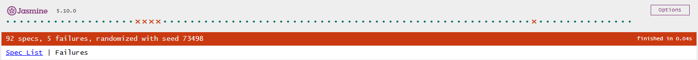
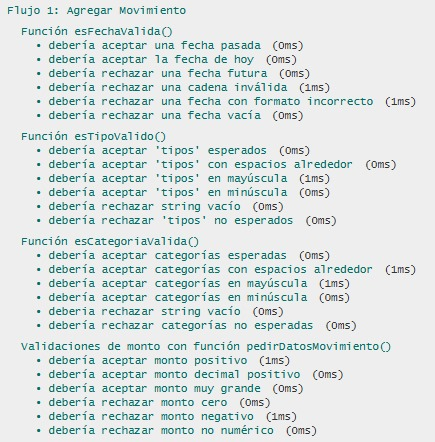
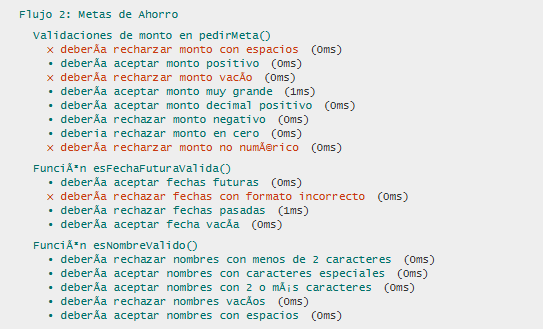
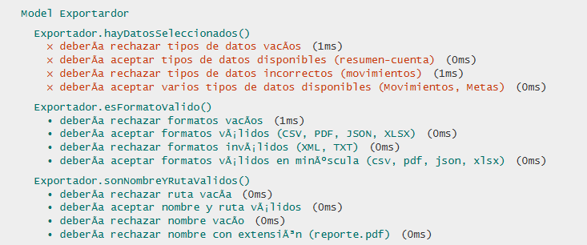
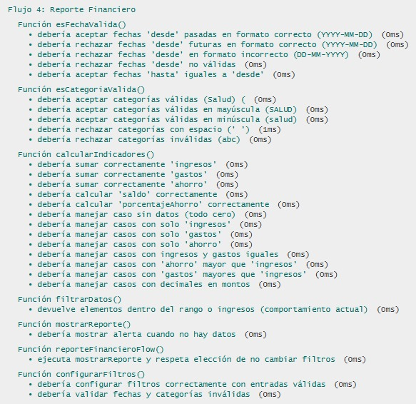
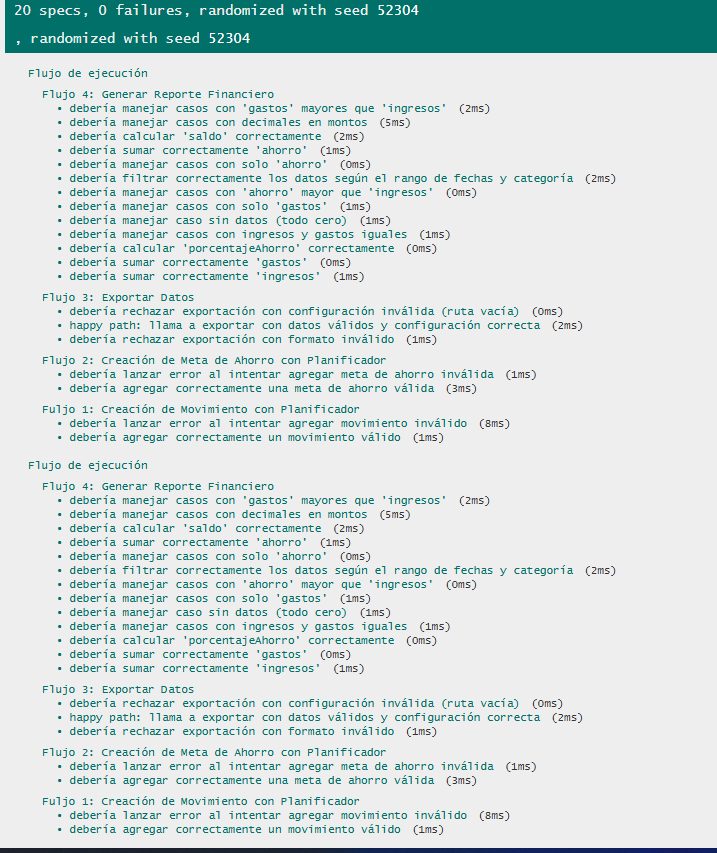
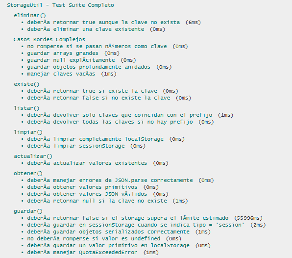

# Documentación de Testing - Suite Jasmine

## Índice
1. [Ejecución de Tests](#ejecución-de-tests)
2. [Suites de Tests](#suites-de-tests)
3. [Métricas de Cobertura](#métricas-de-cobertura)
4. [Capturas de Pantalla](#capturas-de-pantalla)
5. [Issues Conocidos](#issues-conocidos)

---

## Ejecución de Tests

### Pasos para Ejecutar
1. Abrir `test-runner.html` en el navegador con Live Server
2. Los tests se ejecutan automáticamente
3. Verificar resultados en la interfaz de Jasmine

### Interpretación de Resultados
- **Verde**: Tests pasando ✅
- **Rojo**: Tests fallando ❌
- **Amarillo**: Tests pendientes ⚠️

---

## Suites de Tests

### Suite 1: Model Movimiento

#### Funciones Testeadas:
- **`Movimiento.esFechaValida()`**: Valida si una fecha es correcta (no futura, formato válido).
- **`Movimiento.esTipoValido()`**: Verifica si el tipo de movimiento es uno de los esperados.
- **`Movimiento.esCategoriaValida()`**: Valida si la categoría de movimiento es una de las permitidas.
- **`Movimiento.validar()`**: Valida los datos de un movimiento, incluyendo fecha, tipo, categoría y monto.


#### Test 1: `Movimiento.esFechaValida()`

**Casos de Prueba:**

| #  | Descripción                             | Tipo                  |
|----|----------------------------------------|-----------------------|
| 1  | Debería aceptar una fecha pasada       | Happy Path            |
| 2  | Debería aceptar la fecha de hoy        | Happy Path            |
| 3  | Debería rechazar una fecha futura      | Validación de Errores |
| 4  | Debería rechazar una cadena inválida   | Validación de Errores |
| 5  | Debería rechazar una fecha con formato incorrecto | Validación de Errores |
| 6  | Debería rechazar una fecha vacía       | Validación de Errores |


#### Test 2: `Movimiento.esTipoValido()`

**Casos de Prueba:**

| #  | Descripción                             | Tipo                  |
|----|----------------------------------------|-----------------------|
| 1  | Debería aceptar tipos esperados        | Happy Path            |
| 2  | Debería aceptar tipos con espacios alrededor | Happy Path            |
| 3  | Debería aceptar tipos en mayúsculas    | Happy Path            |
| 4  | Debería aceptar tipos en minúsculas    | Happy Path            |
| 5  | Debería rechazar string vacío          | Validación de Errores |
| 6  | Debería rechazar tipos no esperados    | Validación de Errores |


#### Test 3: `Movimiento.esCategoriaValida()`

**Casos de Prueba:**

| #  | Descripción                             | Tipo                  |
|----|----------------------------------------|-----------------------|
| 1  | Debería aceptar categorías esperadas    | Happy Path            |
| 2  | Debería aceptar categorías con espacios alrededor | Happy Path            |
| 3  | Debería aceptar categorías en mayúsculas | Happy Path            |
| 4  | Debería aceptar categorías en minúsculas | Happy Path            |
| 5  | Debería rechazar string vacío          | Validación de Errores |
| 6  | Debería rechazar categorías no esperadas | Validación de Errores |


#### Test 4: `Movimiento.validar()`

**Casos de Prueba:**

| #  | Descripción                             | Tipo                  |
|----|----------------------------------------|-----------------------|
| 1  | Debería aceptar monto positivo         | Happy Path            |
| 2  | Debería aceptar monto decimal positivo | Happy Path            |
| 3  | Debería aceptar monto muy grande       | Happy Path            |
| 4  | Debería rechazar monto cero            | Validación de Errores |
| 5  | Debería rechazar monto negativo        | Validación de Errores |
| 6  | Debería rechazar monto no numérico     | Validación de Errores |

---
---

### Suite 2: Model Metas de Ahorro

#### Funciones Testeadas:
- **`MetaAhorro.esNombreValido()`**: Verifica que el nombre de la meta sea válido (con al menos 2 caracteres, sin estar vacío, etc.).
- **`MetaAhorro.esMontoValido()`**: Valida que el monto objetivo sea un número positivo, sin ser cero ni negativo.
- **`MetaAhorro.esFechaFuturaValida()`**: Verifica si la fecha objetivo es una fecha futura válida.

#### Test 1: `MetaAhorro.esNombreValido()`

**Casos de Prueba:**

| #  | Descripción                             | Tipo                  |
|----|----------------------------------------|-----------------------|
| 1  | Debería aceptar nombres con 2 o más caracteres | Happy Path        |
| 2  | Debería aceptar nombres con espacios   | Happy Path            |
| 3  | Debería aceptar nombres con caracteres especiales | Happy Path        |
| 4  | Debería rechazar nombres con menos de 2 caracteres | Validación de Errores |
| 5  | Debería rechazar nombres vacíos        | Validación de Errores |


#### Test 2: `MetaAhorro.esMontoValido()`

**Casos de Prueba:**

| #  | Descripción                             | Tipo                  |
|----|----------------------------------------|-----------------------|
| 1  | Debería aceptar monto positivo         | Happy Path            |
| 2  | Debería aceptar monto decimal positivo | Happy Path            |
| 3  | Debería aceptar monto muy grande       | Happy Path            |
| 4  | Debería rechazar monto cero            | Validación de Errores |
| 5  | Debería rechazar monto negativo        | Validación de Errores |
| 6  | Debería rechazar monto vacío           | Validación de Errores |
| 7  | Debería rechazar monto no numérico     | Validación de Errores |
| 8  | Debería aceptar montos con espacios adelante y/o al final | Happy Path  |


#### Test 3: `MetaAhorro.esFechaFuturaValida()`

**Casos de Prueba:**

| #  | Descripción                             | Tipo                  |
|----|----------------------------------------|-----------------------|
| 1  | Debería aceptar fechas futuras         | Happy Path            |
| 2  | Debería aceptar fecha vacía            | Happy Path            |
| 3  | Debería rechazar fechas pasadas        | Validación de Errores |
| 4  | Debería rechazar fechas con formato incorrecto | Validación de Errores |

---
---

### Suite 3: Model Exportador

#### Funciones Testeadas:
- **`Exportador.hayDatosSeleccionados()`**: Verifica que los datos seleccionados sean válidos según los tipos predefinidos.
- **`Exportador.esFormatoValido()`**: Valida que el formato de exportación sea uno de los permitidos (CSV, PDF, JSON, XLSX).
- **`Exportador.sonNombreYRutaValidos()`**: Verifica que el nombre del archivo y la ruta de destino sean válidos.


#### Test 1: `Exportador.hayDatosSeleccionados()`

**Casos de Prueba:**

| #  | Descripción                                             | Tipo                  |
|----|---------------------------------------------------------|-----------------------|
| 1  | Debería aceptar tipos de datos disponibles (resumen-cuenta) | Happy Path            |
| 2  | Debería aceptar varios tipos de datos disponibles (Movimientos, Metas) | Happy Path            |
| 3  | Debería rechazar tipos de datos incorrectos (movimientos) | Validación de Errores |
| 4  | Debería rechazar tipos de datos vacíos                  | Validación de Errores |


#### Test 2: `Exportador.esFormatoValido()`

**Casos de Prueba:**

| #  | Descripción                                             | Tipo                  |
|----|---------------------------------------------------------|-----------------------|
| 1  | Debería aceptar formatos válidos (CSV, PDF, JSON, XLSX) | Happy Path            |
| 2  | Debería aceptar formatos válidos en minúscula (csv, pdf, json, xlsx) | Happy Path            |
| 3  | Debería rechazar formatos inválidos (XML, TXT)          | Validación de Errores |
| 4  | Debería rechazar formatos vacíos                        | Validación de Errores |


#### Test 3: `Exportador.sonNombreYRutaValidos()`

**Casos de Prueba:**

| #  | Descripción                                             | Tipo                  |
|----|---------------------------------------------------------|-----------------------|
| 1  | Debería aceptar nombre y ruta válidos                   | Happy Path            |
| 2  | Debería rechazar nombre vacío                           | Validación de Errores |
| 3  | Debería rechazar ruta vacía                             | Validación de Errores |
| 4  | Debería rechazar nombre con extensión (reporte.pdf)     | Validación de Errores |


---

### Suite 4: Model Planificador

#### Funciones Testeadas:
- **`Planificador.agregarMovimiento()`**: Valida que los movimientos sean agregados correctamente con las categorías y fechas adecuadas.
- **`Planificador.eliminarMovimiento()`**: Verifica que los movimientos sean eliminados correctamente.
- **`Planificador.agregarMetaAhorro()`**: Asegura que las metas de ahorro sean agregadas correctamente con validaciones de formato y valores.


#### Test 1: `Planificador.agregarMovimiento()`

**Casos de Prueba:**

| #  | Descripción                                              | Tipo                  |
|----|----------------------------------------------------------|-----------------------|
| 1  | Debería aceptar movimientos con categoría válida (salud) | Happy Path            |
| 2  | Debería aceptar categorías válidas en mayúscula (SALUD)  | Happy Path            |
| 3  | Debería aceptar categorías válidas en minúscula (salud)  | Happy Path            |
| 4  | Debería rechazar categorías con espacios (' ')           | Validación de Errores |
| 5  | Debería rechazar categorías inválidas (abc)              | Validación de Errores |
| 6  | Debería rechazar fechas 'desde' futuras en formato correcto (YYYY-MM-DD) | Validación de Errores |
| 7  | Debería rechazar fechas en formato incorrecto (DD-MM-YYYY) | Validación de Errores |
| 8  | Debería rechazar fechas 'desde' no válidas               | Validación de Errores |


#### Test 2: `Planificador.eliminarMovimiento()`

**Casos de Prueba:**

| #  | Descripción                                              | Tipo                  |
|----|----------------------------------------------------------|-----------------------|
| 1  | Debería eliminar un movimiento correctamente             | Happy Path            |
| 2  | Debería no eliminar un movimiento que no existe         | Validación de Errores |
| 3  | Debería eliminar un movimiento correctamente usando un identificador único | Happy Path            |


#### Test 3: `Planificador.agregarMetaAhorro()`

**Casos de Prueba:**

| #  | Descripción                                              | Tipo                  |
|----|----------------------------------------------------------|-----------------------|
| 1  | Debería agregar una meta válida correctamente            | Happy Path            |
| 2  | Debería agregar la meta al arreglo interno `metasAhorro` | Happy Path            |
| 3  | Debería lanzar error si el nombre está vacío             | Validación de Errores |
| 4  | Debería lanzar error si el monto objetivo no es un número | Validación de Errores |
| 5  | Debería lanzar error si el monto objetivo es negativo    | Validación de Errores |
| 6  | Debería lanzar error si la fecha está en formato incorrecto | Validación de Errores |
| 7  | Debería lanzar error si la fecha objetivo es pasada      | Validación de Errores |
| 8  | Debería devolver un objeto `MetaAhorro` válido al agregarse | Happy Path            |

---
---

### Suite 5: Flujo de Ejecución - Planificador

#### Funciones Testeadas:
- **`Planificador.agregarMovimiento()`**: Asegura que los movimientos sean correctamente agregados a la lista de movimientos, validando datos y manejando errores.
- **`Planificador.agregarMetaAhorro()`**: Verifica que las metas de ahorro sean correctamente creadas, incluyendo validaciones para los valores de las metas.
- **`Exportador.exportar()`**: Valida la correcta exportación de datos según la configuración y formato especificado.
- **`Planificador.generarReporte()`**: Genera reportes financieros correctos basados en los movimientos registrados.

#### Test 1: `Planificador.agregarMovimiento()`

**Casos de Prueba:**

| #  | Descripción                                                | Tipo                  |
|----|------------------------------------------------------------|-----------------------|
| 1  | Debería agregar correctamente un movimiento válido        | Happy Path            |
| 2  | Debería lanzar error al intentar agregar un movimiento con datos inválidos | Validación de Errores |


#### Test 2: `Planificador.agregarMetaAhorro()`

**Casos de Prueba:**

| #  | Descripción                                                | Tipo                  |
|----|------------------------------------------------------------|-----------------------|
| 1  | Debería agregar correctamente una meta de ahorro válida   | Happy Path            |
| 2  | Debería lanzar error si el monto objetivo es negativo     | Validación de Errores |
| 3  | Debería lanzar error si la fecha objetivo es incorrecta   | Validación de Errores |


#### Test 3: `Exportador.exportar()`

**Casos de Prueba:**

| #  | Descripción                                                | Tipo                  |
|----|------------------------------------------------------------|-----------------------|
| 1  | Debería exportar correctamente con datos válidos y configuración correcta | Happy Path            |
| 2  | Debería rechazar exportación con formato no soportado (XML) | Validación de Errores |
| 3  | Debería rechazar exportación con ruta vacía               | Validación de Errores |


#### Test 4: `Planificador.generarReporte()`

**Casos de Prueba:**

| #  | Descripción                                                | Tipo                  |
|----|------------------------------------------------------------|-----------------------|
| 1  | Debería calcular correctamente los ingresos totales       | Happy Path            |
| 2  | Debería calcular correctamente los gastos totales         | Happy Path            |
| 3  | Debería calcular correctamente el ahorro total            | Happy Path            |
| 4  | Debería calcular correctamente el saldo total             | Happy Path            |
| 5  | Debería calcular correctamente el porcentaje de ahorro    | Happy Path            |
| 6  | Debería manejar caso sin datos (todo cero)                | Validación de Errores |
| 7  | Debería manejar casos con solo 'gastos'                   | Validación de Errores |
| 8  | Debería manejar casos con solo 'ahorro'                   | Validación de Errores |
| 9  | Debería manejar casos con ingresos y gastos iguales       | Validación de Errores |
| 10 | Debería manejar casos con 'ahorro' mayor que 'ingresos'   | Validación de Errores |
| 11 | Debería manejar casos con 'gastos' mayores que 'ingresos' | Validación de Errores |
| 12 | Debería manejar casos con decimales en los montos         | Happy Path            |
| 13 | Debería filtrar correctamente los datos según el rango de fechas y categoría | Happy Path            |

---
---

### Suite 6: Util StorageUtil

#### Funciones Testeadas:
- **`StorageUtil.guardar()`**: Guarda valores en localStorage o sessionStorage con validaciones, serialización y manejo de errores.
- **`StorageUtil.obtener()`**: Recupera valores almacenados, decodificando JSON cuando corresponde y manejando datos corruptos.
- **`StorageUtil.actualizar()`**: Actualiza claves existentes en el storage sin perder integridad.
- **`StorageUtil.eliminar()`**: Elimina claves de forma segura tanto en local como en session.
- **`StorageUtil.listar()`**: Lista todas las claves del storage o las que coincidan con un prefijo.
- **`StorageUtil.limpiar()`**: Limpia completamente el storage seleccionado.
- **`StorageUtil.existe()`**: Verifica si una clave está presente en el storage.

#### Test 1: `StorageUtil.guardar()`

**Casos de Prueba:**

| #  | Descripción                                                | Tipo                  |
|----|------------------------------------------------------------|-----------------------|
|1	|Guardar un valor primitivo en localStorage					|Happy Path             |
|2	|Guardar objetos serializados correctamente						|Happy Path             |
|3	|Guardar en sessionStorage cuando se indica tipo = 'session'			|Happy Path             |
|4	|Maneja error QuotaExceededError					|Validación de Errores  |
|5	|Rechaza guardar datos excesivamente grandes		|Validación de Errores  |
|6	|No debería romperse si el valor es undefined		|Validación de Errores  |


#### Test 2: `StorageUtil.obtener()`

**Casos de Prueba:**

| #  | Descripción                                                | Tipo                  |
|----|------------------------------------------------------------|-----------------------|
|1	|Obtiene correctamente strings											|Happy Path				|
|3	|Obtiene correctamente objetos JSON										|Happy Path             |   
|3	|Retorna null cuando la clave no existe									|Happy Path             |   
|4	|Maneja JSON corrupto devolviendo null									|Validación de Errores  |   


#### Test 3: `StorageUtil.actualizar()`

**Casos de Prueba:**

| #  | Descripción                                                | Tipo                  |
|----|------------------------------------------------------------|-----------------------|
|1	|Actualiza correctamente una clave ya existente							|Happy Path             |   


#### Test 4: `StorageUtil.eliminar()`

**Casos de Prueba:**

| #  | Descripción                                                | Tipo                  |
|----|------------------------------------------------------------|-----------------------|
|1	|Elimina correctamente una clave existente								|Happy Path             |   
|2	|Retorna true aunque la clave no exista									|Happy Path             |   

#### Test 5: `StorageUtil.listar()`

**Casos de Prueba:**

| #  | Descripción                                                | Tipo                  |
|----|------------------------------------------------------------|-----------------------|
|1	|Lista solo claves con un prefijo específico							|Happy Path             |   
|2	|Retorna arreglo vacío cuando no hay coincidencias						|Happy Path             | 

#### Test 6: `StorageUtil.limpiar()`

**Casos de Prueba:**

| #  | Descripción                                                | Tipo                  |
|----|------------------------------------------------------------|-----------------------|
|1	|Limpia completamente localStorage										|Happy Path             |   
|2	|Limpia completamente sessionStorage									|Happy Path             |   

#### Test 7: `StorageUtil.existe()`

**Casos de Prueba:**

| #  | Descripción                                                | Tipo                  |
|----|------------------------------------------------------------|-----------------------|
|1	|Retorna true si la clave existe										|Happy Path             |   
|2	|Retorna false si la clave no existe									|Happy Path             |   

#### Test 8: `Casos extremos`

**Casos de Prueba:**

| #  | Descripción                                                | Tipo                  |
|----|------------------------------------------------------------|-----------------------|
|1	|Guardar objetos muy anidados											|Stress Test            |   
|2	|Guardar arrays masivos (>200 ítems)									|Stress Test            |     
|3	|guardar null explícitamente			|Happy Path             |   
|4	|manejar claves vacías		|Happy Path             |   
|5	|no romperse si se pasan números como clave	|Happy Path             |   

---
---

## Métricas de Cobertura

### Resumen General
| Métrica | Valor |
|---------|-------|
| Total de Tests      |116 |
| Tests Pasando       |112 ✅ |
| Tests Fallando      |4 ❌ |
| Porcentaje de Éxito |96,5% |

### Cobertura por Tipo de Test
| Tipo                       | Cantidad | Porcentaje |
|----------------------------|----------|------------|
| Happy Path                 | 62       | 53.5%        |
|Stress Test                 |  2       |       2%|
| Validación de Errores      | 52       | 44.5%        |


---

## Capturas de Pantalla

### Tests Pasando
  

### Vista Detallada de Suites
  
 
 
  
  
  

---

## Issues Conocidos

### Issue #153: Manejo de decimales en montos (porcentajeAhorro) en Reporte Financiero.
- **Severidad:** Baja
- **Suite Afectada:** `describe("Exportador.hayDatosSeleccionados()")`
- **Tests Afectados:** `it ("debería aceptar tipos de datos disponibles (resumen-cuenta)")`, `it("debería aceptar varios tipos de datos disponibles (Movimientos, Metas)"`, ` it("debería rechazar tipos de datos incorrectos (movimientos)"`, `it("debería rechazar tipos de datos vacíos"` 
- **Comportamiento Esperado:** Que el exportador envié un mensaje de error al usuario que no ha seleccionado los campos campos necesarios, ni enviado los datos.
- **Comportamiento Obtenido:** No hay ningún mensjae, dado que no existe ninguna validación.
- **Pasos para Reproducir:**
  1. Ir al apartado de exportación de Dato no seleccionar nada ni llenar ningún campo y apretar el botón exportar.
- **Código del Test que Falla:**
  ```javascript
  it("debería aceptar tipos de datos disponibles (resumen-cuenta)", function () {
            const seleccion = "resumen-cuenta";
            const tiposDisponibles = ['transacciones', 'inversiones', 'performance', 'contribuciones', 'asignaciones', 'balances', 'flujo-fondos', 'descripcion-general', 'resumen-cuenta'];
            const tiposSeleccionados = seleccion
                ? seleccion.split(',').map(e => e.trim()).filter(e => tiposDisponibles.includes(e.toLowerCase()))
                : [];

            expect(exportador.hayDatosSeleccionados(tiposSeleccionados, seleccion.split(','))).toBeTrue();
        });

        it("debería aceptar varios tipos de datos disponibles (Movimientos, Metas)", function () {
            const seleccion = "resumen-cuenta, inversiones";
            const tiposDisponibles = ['transacciones', 'inversiones', 'performance', 'contribuciones', 'asignaciones', 'balances', 'flujo-fondos', 'descripcion-general', 'resumen-cuenta'];
            const tiposSeleccionados = seleccion
                ? seleccion.split(',').map(e => e.trim()).filter(e => tiposDisponibles.includes(e.toLowerCase()))
                : [];

            expect(exportador.hayDatosSeleccionados(tiposSeleccionados, seleccion.split(','))).toBeTrue();
        });

        it("debería rechazar tipos de datos incorrectos (movimientos)", function () {
            const seleccion = "movimientos";
            const tiposDisponibles = ['transacciones', 'inversiones', 'performance', 'contribuciones', 'asignaciones', 'balances', 'flujo-fondos', 'descripcion-general', 'resumen-cuenta'];
            const tiposSeleccionados = seleccion
                ? seleccion.split(',').map(e => e.trim()).filter(e => tiposDisponibles.includes(e.toLowerCase()))
                : [];

            expect(exportador.hayDatosSeleccionados(tiposSeleccionados, seleccion.split(','))).toBeFalse();
        });

        it("debería rechazar tipos de datos vacíos", function () {
            const seleccion = "";
            const tiposDisponibles = ['transacciones', 'inversiones', 'performance', 'contribuciones', 'asignaciones', 'balances', 'flujo-fondos', 'descripcion-general', 'resumen-cuenta'];
            const tiposSeleccionados = seleccion
                ? seleccion.split(',').map(e => e.trim()).filter(e => tiposDisponibles.includes(e.toLowerCase()))
                : [];

            expect(exportador.hayDatosSeleccionados(tiposSeleccionados, seleccion.split(','))).toBeFalse();
        });
  ```
- **GitHub Issue:** [#153](https://github.com/fioremos/simulador-planificacion-financiera/issues/153)
- **Estado:** Abierto

### Issue #154: Manejo de decimales en montos (porcentajeAhorro) en Reporte Financiero.
- **Severidad:** Alta
- **Suite Afectada:** `describe("Flujo 4: Generar Reporte Financiero")`
- **Test Afectado:** `it ("debería filtrar correctamente los datos según el rango de fechas y categoría")`
- **Comportamiento Esperado:** Generar el reporte filtrando por los rangos correctors.
- **Comportamiento Obtenido:** Error ya que la comparación que se realiza en el codigo no es del tipo Date.
- **Pasos para Reproducir:**
  1. En este caso se simulo directamente en el test, dado a que no existe una funcionalidad como tal para ingresar los dias explicitos de los rangos.
- **Código del Test que Falla:**
  ```javascript
  it("debería filtrar correctamente los datos según el rango de fechas y categoría", function () {
            planificador.agregarMovimiento({ tipo: 'Ingreso', monto: 1000, fecha: '2025-01-10', categoria: 'Sueldo' });
            planificador.agregarMovimiento({ tipo: 'Ingreso', monto: 500, fecha: '2025-02-10', categoria: 'Sueldo' });
            planificador.agregarMovimiento({ tipo: 'Gasto', monto: 200, fecha: '2025-01-20', categoria: 'Hogar' });
            planificador.agregarMovimiento({ tipo: 'Ahorro', monto: 100, fecha: '2025-03-15', categoria: 'Objetivos' });


            const filtros = { fechaDesde: '2025-01-01', fechaHasta: '2025-02-28', categoria: 'Sueldo' };

            const reporte = planificador.generarReporte(filtros);

            expect(reporte.total.ingresos).toBe(1000);  // Solo el ingreso de 'Sueldo'
            expect(reporte.total.gastos).toBe(0);
            expect(reporte.total.ahorro).toBe(0);
            expect(reporte.total.saldo).toBe(1000);  // Ingresos - 0 = 1000
        });
  ```
- **GitHub Issue:** [#154](https://github.com/fioremos/simulador-planificacion-financiera/issues/154)
- **Estado:** Resuelto
---

## Limitaciones del Testing

Una de las principales limitaciones en el proceso de testing es la falta de análisis exhaustivo de las líneas de código involucradas en las pruebas, lo que ha llevado a una cobertura de código limitada. Además, las pruebas se realizaron de manera superficial para las clases por separado, sin un enfoque integral que contemple su interacción dentro del sistema.

Estas limitaciones se deben principalmente a las restricciones de tiempo con las que se contó durante el desarrollo de las pruebas, lo que impidió realizar un análisis más profundo y exhaustivo de cada componente.

---

**Última Actualización:** 14/11/2025   
**Coordinador / DevOps + Tester QA:** @Skalapuj 
